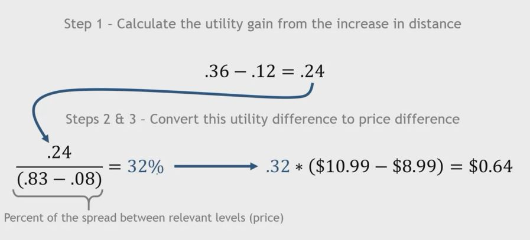

## 1. Example 4 - Willingness-to-Pay

- Currently Considered Model
    - Magnum Force = .43
    - 10 yeards further than average = .12
    - $8.99 for package of three = -.08

    - Total Utility = .47

- How much more would the average golfer be willing to pay for an increase in distance of 5 yards?
    - A little more complicated

## 2. Solving for Willingness-to-pay

1. Calculate utility gain for increase in distance

2. Find the new price such that the utility loss between the original price and the new price exactly equals the utility gain from distance

3. The difference between the new and original price is the increase in willingness-to-pay.

## 3. Example 4 - Solved

- Step1 - Calculate the utility gain from the increase in distance
    - .36 - .12 = .24

- Step 2 & 3 - Convert this utility difference to price difference

    