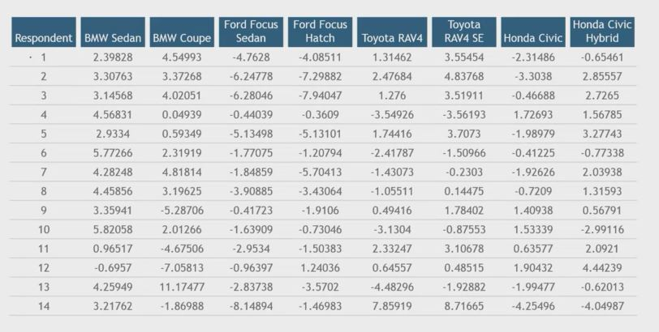
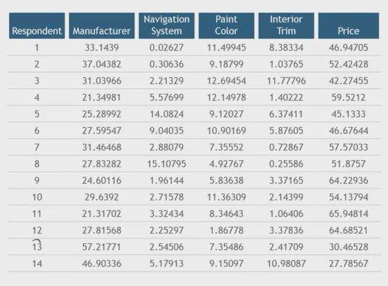

## 1. What else can we do?

- Conjoint on different pre-specified groups of people

- Individual Level Estimation (can be paired with pre-conjoint questionnaire)

- Propensity Modeling in well-established categories with known competitors

## 2. Individual-Level Estimates

## 3. Attribute Importances

## 4. What was I doing?

- Correlation between reported debt and attribute importance for price = -.38

- If I translate debt into a monthly payment correlation reverses and =.26
