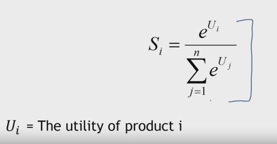
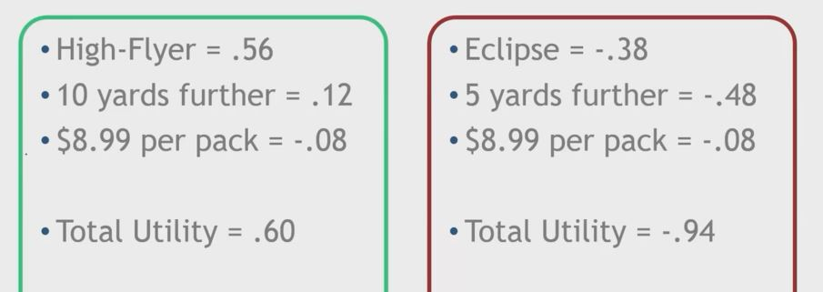
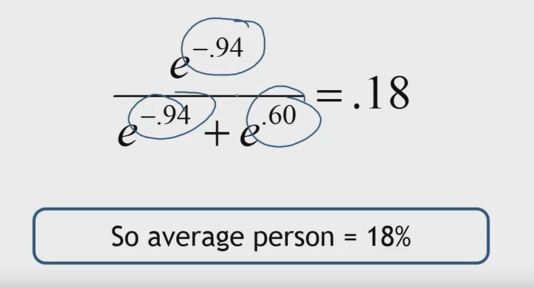
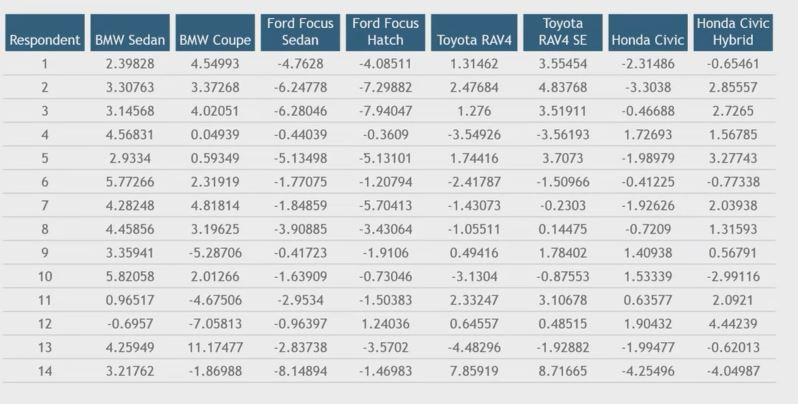

## 1. Propensity Modeling with Conjoint Analysis

- Choice-Based Conjoint Uses a Logit Model

    

## 2. Example 1 Revisited

## 3. What is the probability that the average person will purchase the Eclipse?

## 4. Propensities can be calculated at the individual level

## 5. Use of demand forecase depends on...

- Stable set of competitors
- All competitors are evaluated on the same dimensions
- Assumes no competitive reaction on the given attributes
    - Better for industries with long product development times
    