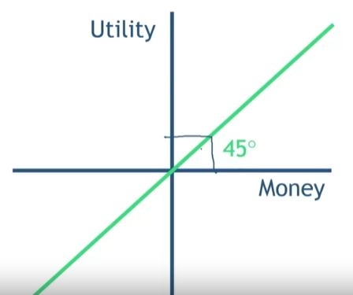

## 1. Money is Not Perfectly Fungible

- U(A) + U(B) != U(A + B)

## 2. Value Function - Rational

## 3. Thaler: Mental Accounting (Situation 1)

## 4. Thaler: Mental Accounting (Situation 2)

## 5. Thaler: Mental Accounting (Sitation 3)

## 6. Thaler: Mental Accounting (Situation 4)

