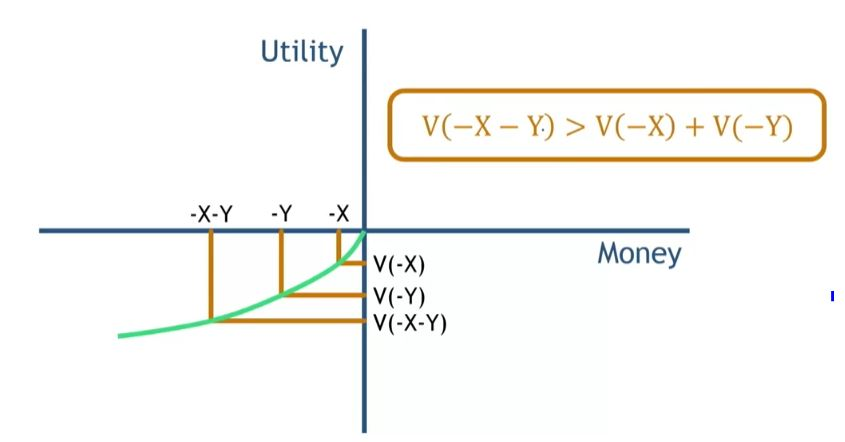

## 1. Value Function - Actual 

## 2. Marketing Implication: Integrate Losses

- Smaller add-ons during the purchase of a larger item
    - Fabric protector for your new car's seats
    - Extended warranties
    - Real estate agent fees

- Hedonic laddering
    - Upsell purchases step-by-step instead of all at once

- Pair fees with a larger gain
    - Mutual funds
    - Any investment management situation
    
