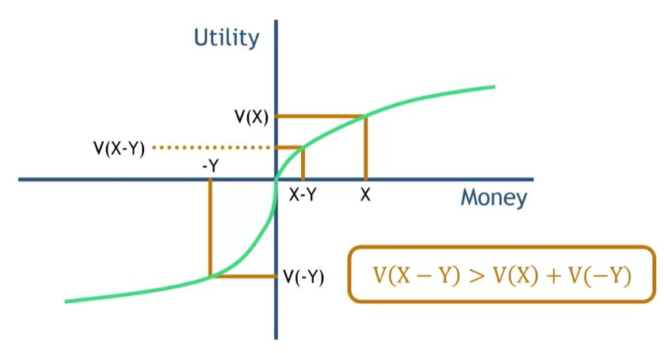
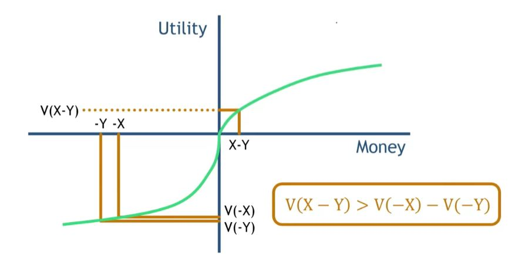

## 1. Value Function - Actual 

## 2. Find the Silver Lining

- Rebates
    - $30,000 will be greeted with less cheer than $30,500 + a $500 rebate

- Reference Prices
    - Compare-at labels induce the feeling of a bonus
    - We are very sensitive to any information about what we "should" be paying for something, and code gains and losses accordingly

## 3. Practical Implication of Mental Accounting

- Separate gains
- Integrate losses
- Pair large losses with small gains

