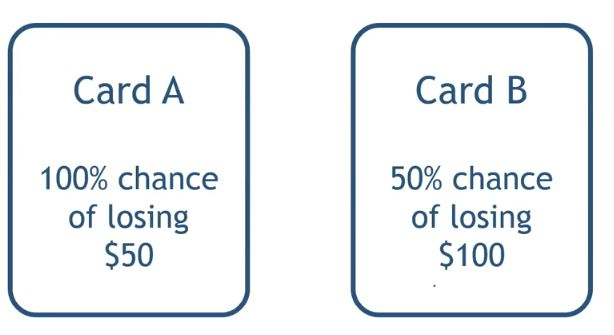

## 1. Price Perception

- How consumers react and feel about given price

- Subjective value of price vs. the absolute value represented by price

## 2. Framing Effect

- Consumers react to any given option depending on whethere it is presented as a gain or as a loss
    - 2% Low-Fat (Gain Frame) vs 98% Fat-Free (Loss Frame)

## 3. Mini game

- Imagine you have just been given $100

    

    - Which card would you choose?

- Imagine you have just been given $200

    

    - Which card would you choose?

