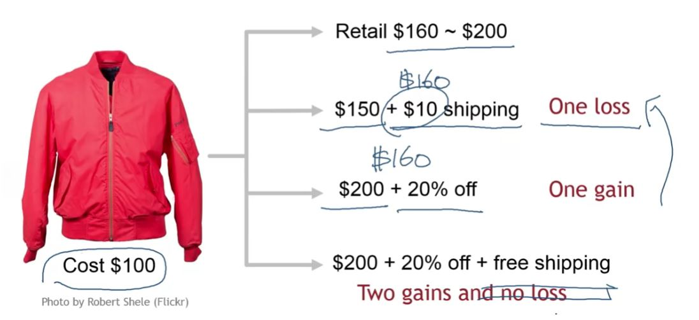

## 1. Gain and Loss Frames in Pricing

- Discounts are perceived as gains
- Surcharges are perceived as losses
- The impact of loss is much greater than the impact of gain of the same magnitude

## 2. Example: Pricing a Jacket

## 3. Framing Effect Takeaway

- Consumers rarely base their decision solely on the economic outcome

- They base decisions on the psychological reaction at the moment of transaction
