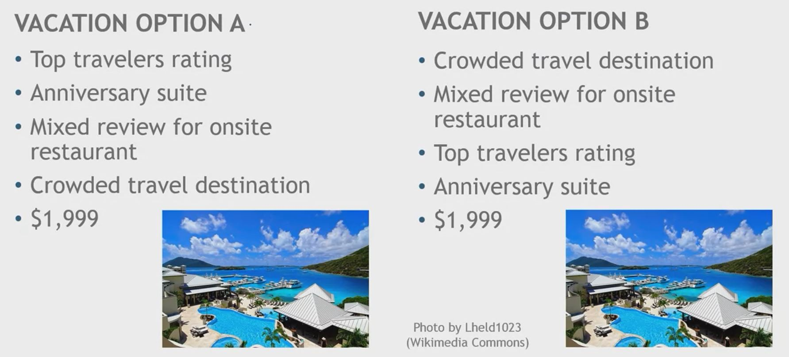
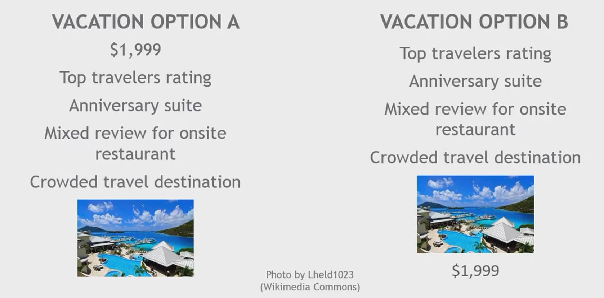

## 1. Mental Shortcuts on Price Perception

- Anchoring
- Price primacy
- Visual tricks to sale prices
- Free as a special price
- Price decoy

## 2. Anchoring

- Initial piece of (unrelated) information has a lasting effect on the processing of subsequent information

- Moving from Hong Kong to Mumbai
    - Likely to use the housing prices in Hong Kong to anchor your evaluation of houses in Mumbai

- Suggested price
- Comparable price
- Price of previous model
- Purchase quantity
- Preferable attributes

## 3. Price Primacy

- When price is revealed before product attribute, consumers evaluate the product based on its worth
- When price is revealed after product attribute, consumers evaluate the product based on how much they like the product
- Application
    - Reveal price for low-price or need-based products
    - Reveal product attribute first for premium-price products
    