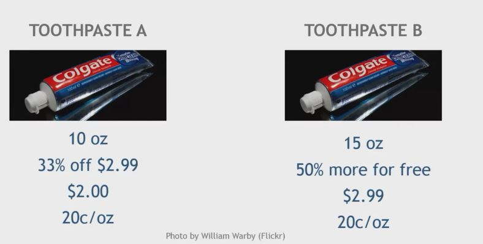

## 1. Visual Tricks to Sale Prices

- Visual contrast highlights the salience of a price promotion
    - Retail price $199.99 -> Sale price $199.99

- Position sale price on the right side to facilitate mental computation
    - Retail price $199.99 -> Sale price $129.99
    - Sale price $129.99 <- Retail price $199.99

- Left digit suggests the perceived magnitude of price
    - $129.99 vs $130.00

- Smaller font suggests smaller numerical magnitude
    - Retail price $199.99 -> Sale price $129.99
    - Retail price $199.99 -> Sale price $129.^99

- Use percentage discounts for product under $100
- Use absolute discounts for products over $100
    

## 2. Free as Special Price

- Consumers over-value a free promotion versus the equivalent discount
    

## 3. Consumers Prefer Bonus Offers

## 4. Discount is more attractive for indulgent products

## 5. Hedonic Bundling

- Price discount on the indulgent item within a bundle is most effective

