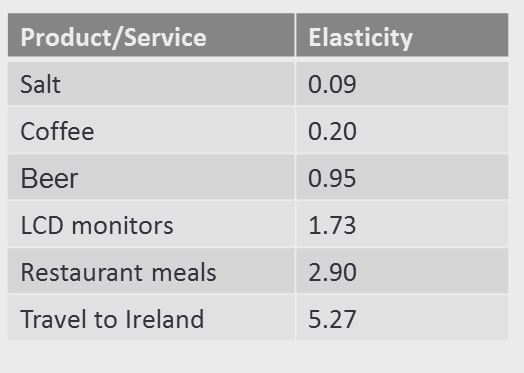

## 1. Demand Curves

- Used to estimate price that should be charged for maximum profits

- The best price for a product maximizes margins - not unit sales

- Demand curves are subject to frequent change

- Affected by 
    - Competitive pressures
    - Customer sentiment
    - Macroeconomic factors

## 2. Estimating Best Price

- Need two things to estimate best price
    - Variable cost to produce one unit of product
    - Product's demand curve

- COG(Cost of goods) : Variable cost to produce one unit of product

- p : price we charge customers for 1 unit of product

- D(p) : customer demand, in units of product, at price p

- Profit margin formula : 

    - Margin = (p - COG) * D(p)

## 3. Price Elasticity

- The amount demand decreases if prices increased by 1%

- Product is price elastic if its elasticity > 1
    - Decreasing price of product will increase revenue

- Product is price inelastic if its elasticity < 1
    - Decreasing price of product will decrease revenue

- Examples of price elasticity values in Boston MSA:
    

- Good pricing decisions require understanding of products' price elasticity

## 4. Demand Curves

- Two most popular types of demand curves
    - Linear Demand Curves
    - Power Demand Curves

## 5. Linear Demand Curves

- Straight-line relationship between price and demand

    - D = a - bp
        - D : units of product demanded by customers
        - p : per-unit price
        - a & b : adjust curve to fit product's price elasticity

## 6. Power Demand Curves

- Arc that shows relationship between price and demand, when product's price elasticity isn't affected by product's price

    - $D = ap^b$
        - D : units of product demanded by customers
        - p : per-unit price
        - a & b : adjust curve to fit product's price elasticity
        - b is additive inverse of price elasticity (ex : b = -2 if elasticity = 2)

## 7. Which Curve to Use?

- Price elasticity properties tell us which curve is appropriate
- Linear demand curve : if product's price elasticity changes as price changes
- Power demand curve : if product's price elasticity remains constant as price changes

## 8. Constructing Linear Demand Curves

- Scenario
    - We're selling polo shirts for Ralph Lauren
    - Current price per unit p = $90
    - Current demand D = 1,000 shirts
    - Price elasticity of product: 2.0

- We need two points to construct our line:
    - We already know ($90, 1000) is on the curve
    - Increase price by 1% ($0.90), demand will decrease by 2% (20 shirts)
    - Calculated point on curve: ($90.90, 980)

- Linear demand curve equation for this example:

    - D = 3000 - 22.2p

- Implication: Every $0.90 increase in shirt price is going to cost demand for ~22 shirts

- Error rate for linear demand curves increases with distance from current price point

- Pretty good approximation +/- 5% of current price

## 8. Constructing Power Demand Curves

- Use power demand curves when product's price elasticity doesn't change when price changes

- Scenario
    - We're selling polo shirts for Ralph Lauren
    - Current price per unit p = $90
    - Current demand D = 1,000 shirts
    - Price elasticity of product: 2.0
    - Price elasticity doesn't change when price changes

- Value of a determined to be 8,100,000

    - $D = 8,100,000p^-2 $

- Price Elasticity remains constant for every price on the demand curve
