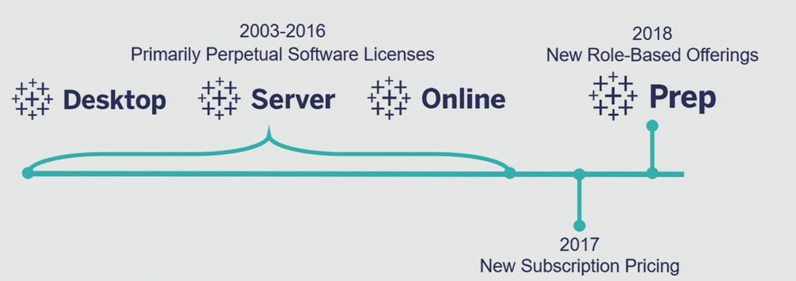
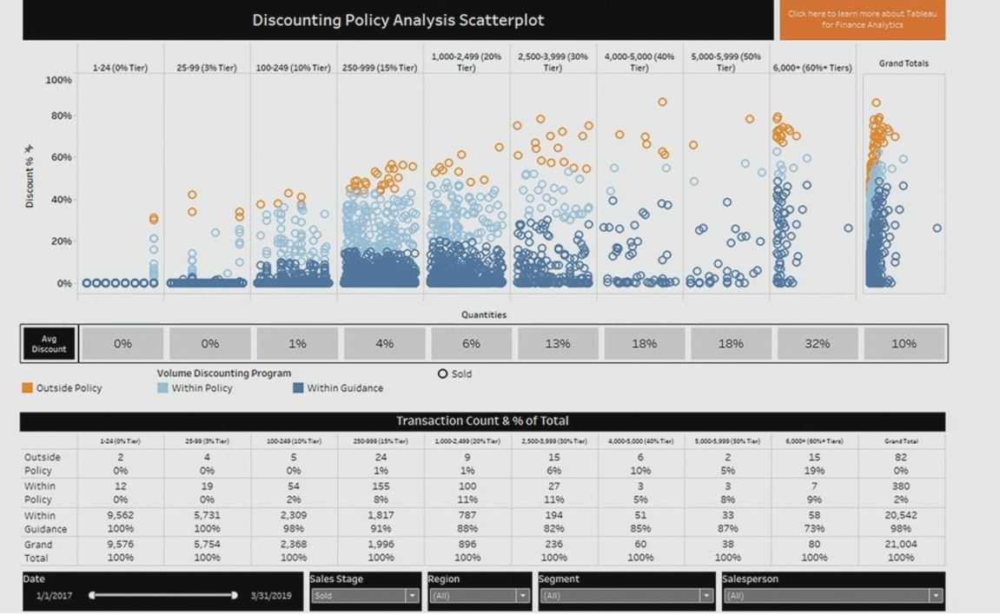

## 1. Why Pricing matters today

- Business Models are changing

- CLTV(Customer Lifetime Value)
    - Initial deal pricing for Subscription has material impact on CLTV
    - 1% Price Up > 1% Sales Volume

- Your offerings are not a commodity - price captures your value!

## 2. Pricing/Revenue Changes at Tableau

## 3. Pricing/Revenue at Tableau

1. Typical Pricing Lifecycle
    - Strategy
    - New Product
    - Pricing Research
    - List Price
    - Negotiations
    - Sales

## 4. Analyzing Historical Sales Data

1. Why Analyze Your Sales Data?
   
    - Lack of Visibility Across Sales Teams
    - Quarterly Pressure to Meet Targets
    - "Gut Feel" Pricing
    - Unnecessary Variability in Pricing = Lost Value

2. Discounting Analysis
    - Bring visibility to discounting across deals
    - Understand the "give/get" equation of your policies

