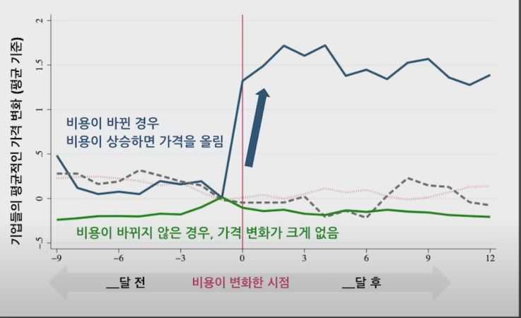

## 1. 프라이싱이란

- 가격은 한 물건을 팔았을 때 기업이 얼마의 수익을 낼 수 있는지 결정하는 중요한 변수이기 때문에 이익에서 굉장히 중요함.
- 상관관계가 아닌 인과관계를 통한 프라이싱이 중요함

## 2. 가격 책정의 방법

- 원가 가산법(Cost-Plus Pricing) 
    - 매출원가 + 마진(제조업자나 서비스 제공기업의 매출총이익) = (정상) 가격. 여기서 매출총이익, 마진은 비교 대상기업을 통해 결정되기도 함 

- Dynamic Pricing

## 3. 기업은 소비자가 가격 변화에 얼마나 민감한지 어떻게 아는 걸까

- 수요의 가격탄력성(Price Elasticity of demand)을 안다는 건 수요 곡선을 계측한다는 것

## 4. Dynamic Pricing

- 제품이나 서비스의 가격을 일률적으로 정하지 않고, 유동적으로 바꾸는 전략
- 전자상거래에 주로 적용했으나, AI가 발달하면서 증가하고 있음

### 4-1 Amazon
1. 2019년 기준, 보통 하루에 거의 100만 번 정도 가격을 변동한다는 통계가 나온적이 있음
2. 신문기사가 나온 뒤, 소비자들의 뭇매를 맞기도 함

### 4-2 Uber
1. 지금 이 지역에 드라이버가 몇 명이고 지금 이 앱을 켜고 주문을 하는 소비자가 얼마나 많은지에 따라서 순식간에 가격이 결정이 됨

    

2. Surge Pricing을 도입함으로써 가격이 달라짐

3. 우버도 소비자들이 화가 난 적이 있었음

4. 부정적 측면도 있지만, Transaction Cost를 줄여서 Market Clearing(특정 제품에 대한 구매의사와 판매의사가 매칭이 되어서, 사고 싶은 사람이나 팔고 싶은 사람이 더 이상 남지 않은 상태)이 빨리 진행될 수 있도록 도움

### 3. 카카오 택시가 다이나믹 프라이싱을 적용하지 않는 이유

1. 미국에서도 모든 산업, 모든 기업에 적용할 수 있는 것은 아님
2. 로빈슨-패트만법 (Robinson-Patman Act - 반독점법의 일환으로, 반경쟁적 행위를 막기 위해 1936년 제정된 법. 체인점에 비해 가격 경쟁 역량이 제한적인 영세업체를 보호하기 위해 고안됨)을 통해 지나친 다이나믹 프라이싱을 규제함.
3. 이를 통해 소비자 효용을 지키는 것이 목표
4. (공급 측면) 우버는 차량을 공유하는 것이니까 운전만 하는 사람이 아니더라도 필요한 경우 운전을 할 수 있는 반면, 카카오택시의 경우 택시를 배차해주는 것이니까 공급이 유연하진 않음
5. (수요 측면) 소비자가 가격차별화를 받아들이는 소비자인가 아닌가가 중요할 수도 있음

### 4. 대부분의 기업들이 이런 가격차별화를 통해 수익성을 키우고 있다고 볼 수 있나?

1. 꼭 그렇진 않음
    - 최근 경제학계에서 논쟁임
    - 차이를 두긴 두는데 가격 차이가 크지 않은 곳도 있음
    

2. 아이스크림은 여름철에 비싸게 & 겨울철에 비싸게 파는걸까?
    - 오히려 성수기에 가격이 내려감

        

    - 왜 그런지 연구해보니 기업들은 비용변화에 따라서는 가격 변화를 굉장히 많이 시킴

        

    - 비수기에도 아이스크림/아이스아메리카노(얼죽아)를 사는 사람들이 사는 사람은 지불 의향이 높은 사람인 경우가 많음
        
    - 성수기에는 사람들이 가격에 민감한 것처럼 보이고 비수기에는 덜 민감한것처럼 보임

### 5. 기업이 수익성을 높이기 위해 쓰는 또 다른 가격 책정 전략이 있나?

1. 도어버스터 전략(미끼상품 전략)
    - 전략적으로 가격을 낮춘 미끼상품(loss leader)을 통해 소비자를 유인해서 주력 상품이나 연관 상품을 판매하는 마케팅 전략
    - Ex - 코스트코 1.99달러 핫도그