## 1. 주가추이
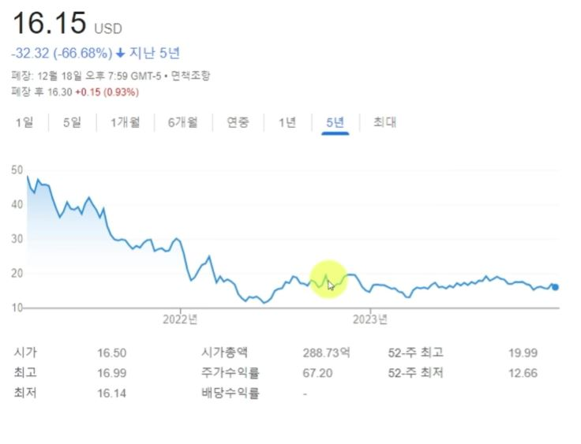

## 2. 최근 5개 분기 실적 요약

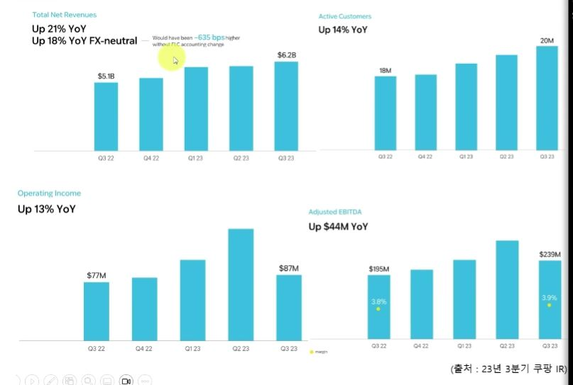

## 3. 국내 유통시장

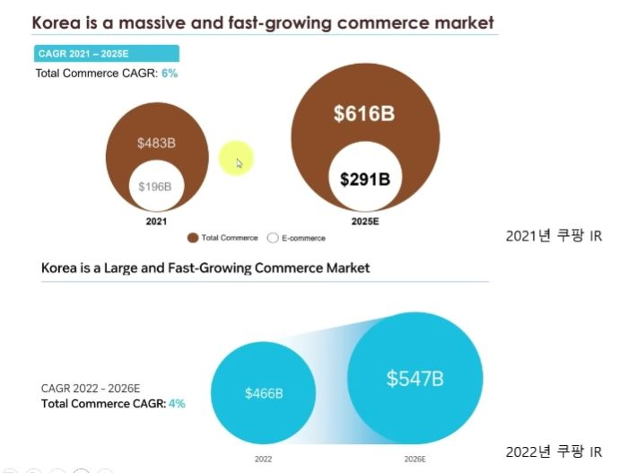

## 4. 유통시장의 변화

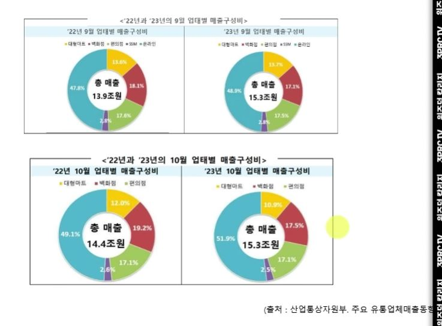

## 5. 23년 9월 온라인쇼핑 동향 및 네이버 3분기 커머스 실적

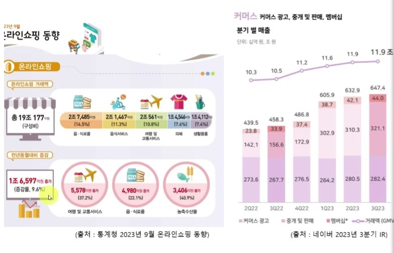

## 6. 부문별 매출액과 조정 EBITDA (커머스)

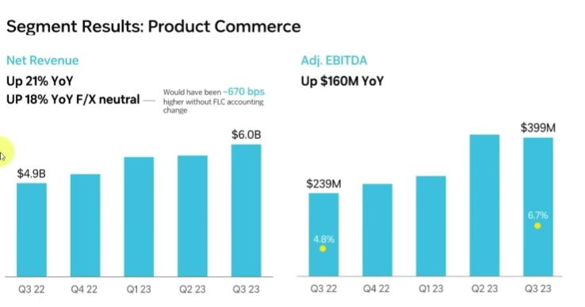

## 7. 부문별 매출액과 조정 EBITDA (커머스)

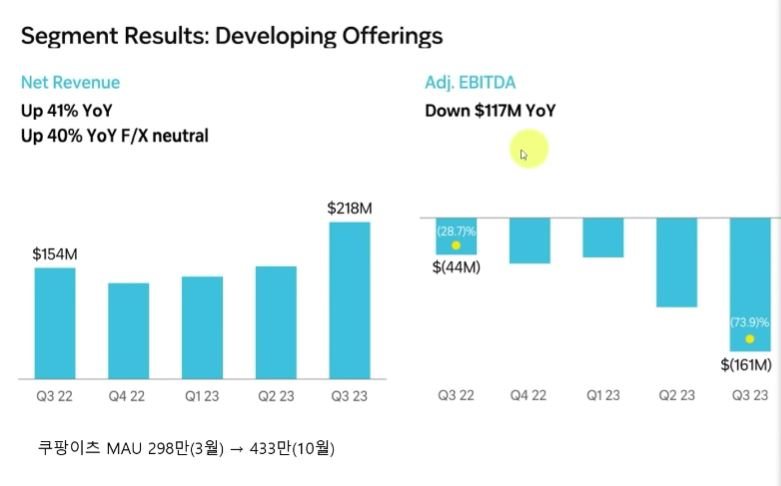

## 8. 분기별 손익과 활성사용자 지표

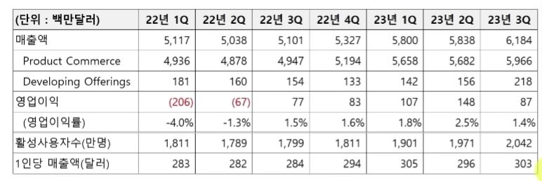

## 9. 파페치 인수 관련

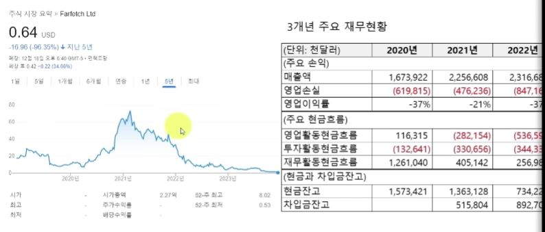

## 10. 쿠팡 재무상태

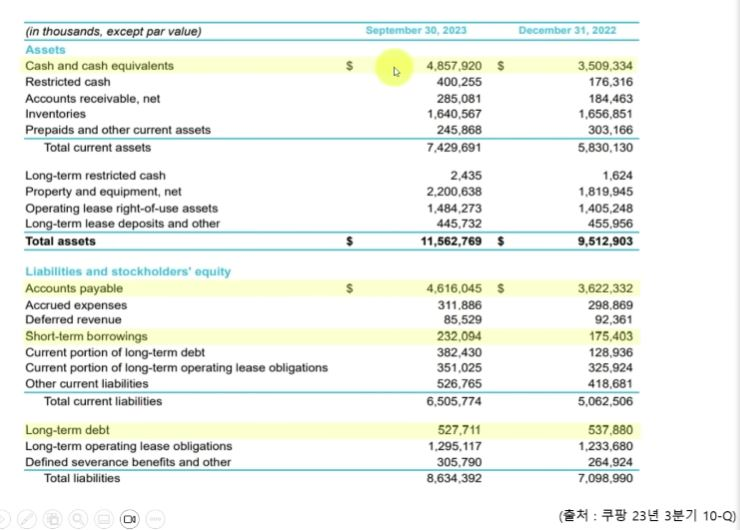

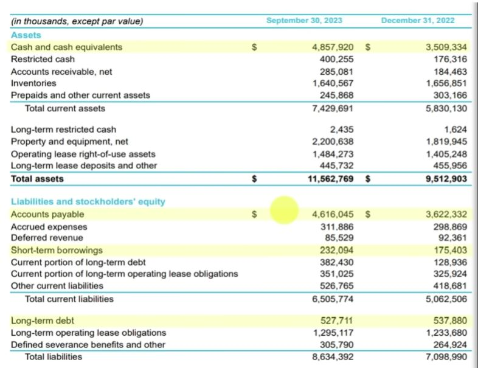
