## 1. 바이오 벤처 IPO 현황

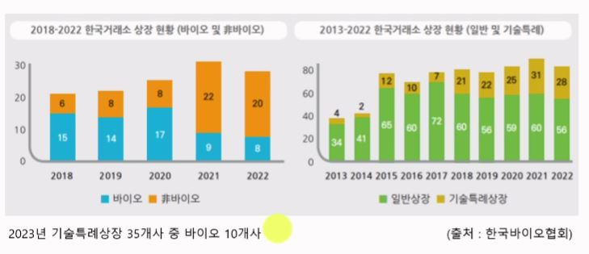

## 2. 분야별 국내 벤처투자 실적요약

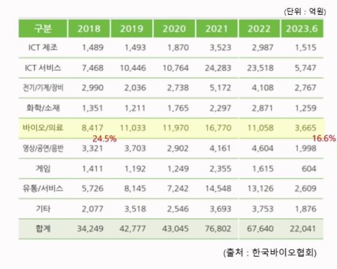

## 3. 의약품 시장의 변화

## 4. 항암제 관련 용어정리

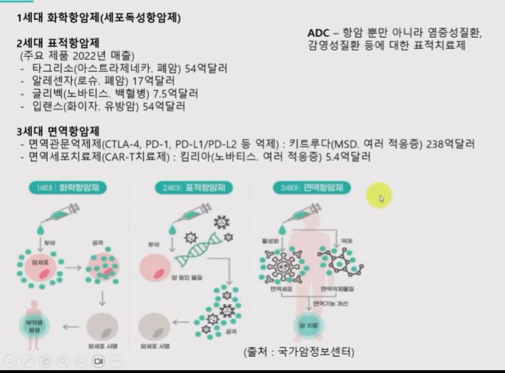

## 5. 2023년 바이오기업 주가하락 순위

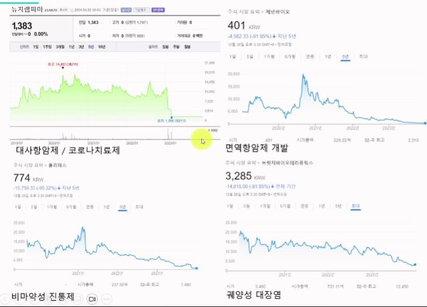

## 6. 기술이전 후 주가상승 기업

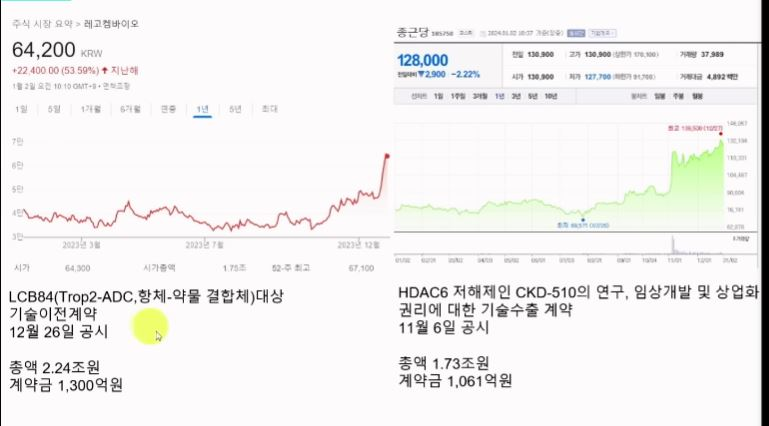

## 7. 화제의 글로벌 제약사

## 8. 레고캠바이오 재무제표

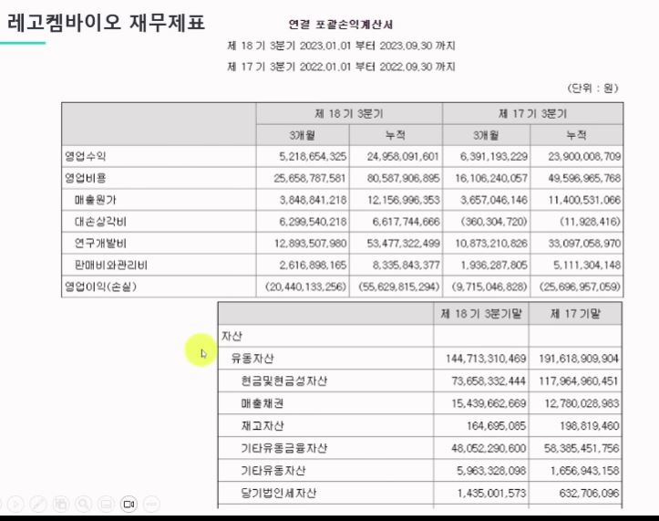

## 9. 레고캠바이오 주요 계약 현황

## 10. 기술이전(L/O)의 가치는?

## 11. 시장규모 추정

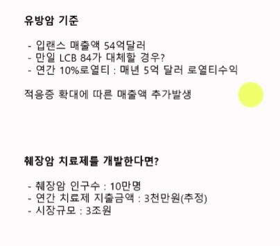

## 12. 임상단계별 성공확률 예시

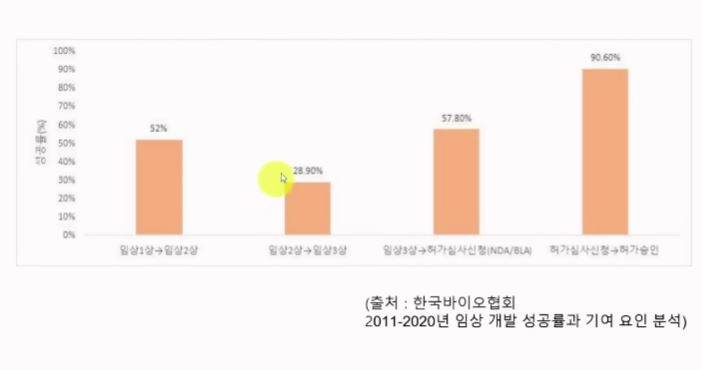

## 13. 증권신고서 사례(에스바이오메딕스)

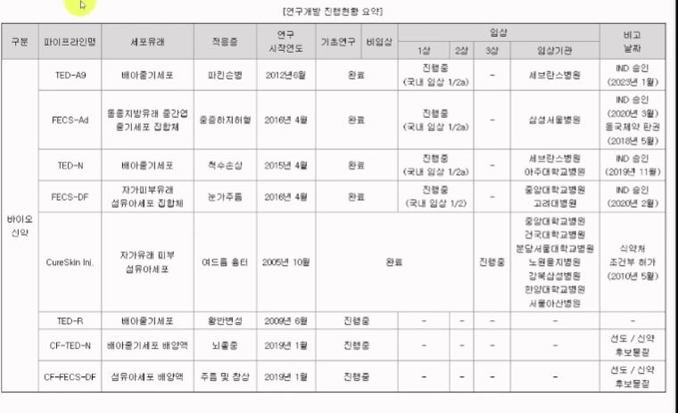

## 14. 증권신고서 사례(기업가치 산정방법)

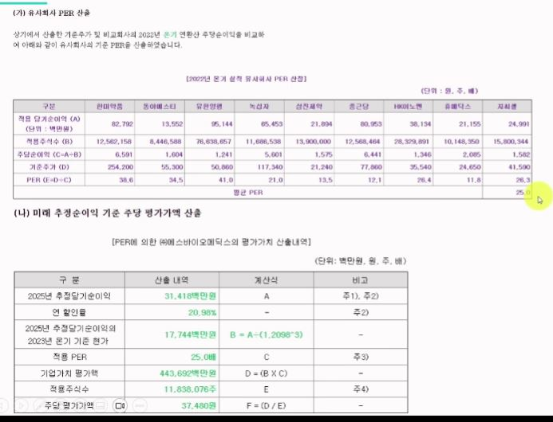

## 15. 증권신고서 사례(매출 추정 방식)

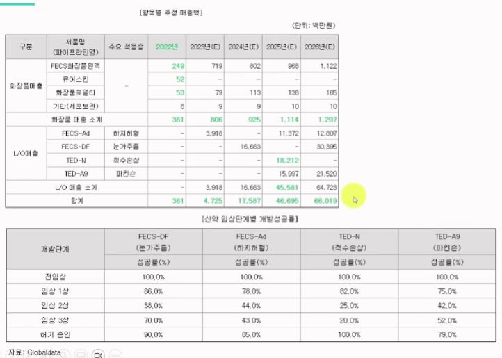

