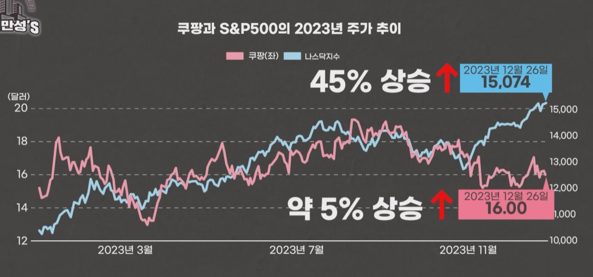

## 1. 쿠팡의 연간 매출, 영업이익

## 2. 쿠팡의 분기 매출과 영업이익

## 3. 쿠팡의 분기당 영업이익률

## 4. 쿠팡의 활성 고객 수 

## 5. 2022년 온라인 쇼핑 점유율

## 6. 미국의 기준금리

## 7. 국내 온라인쇼핑 성장률

## 8. 2023년 10월 국내 온라인 쇼핑 거래액

## 9. 쿠팡 이용자의 1인당 매출

## 10. 쿠팡 주가추이

## 11. 쿠팡 주요 투자자

## 12. 명품 판매에서 온라인 채널의 비중

## 13. 국가별 온라인 쇼핑 침투율

## 14. 파페치의 성공요인

- 샤넬, 루이비통 등의 명품 회사가 직접 물건을 주는 게 아니라 이런 브랜드와 거래하는 도매상의 물건을 팔아주고 수수료 30% 받는 수익모델
- 1400여개 명품 브랜드 입점
- 한국을 비롯 190개국에서 온라인으로 팔고 있음

## 14. 파페치 실적

