## 1. CEO 메시지

1. 풀필먼트 네트워크의 개선
    
    - 고객과 가까운 각 지역 물류 센터에 더 많은 재고를 수용

    - 최종 고객까지의 배송 거리는 이전보다 짧아짐

    - 배송 건당 비용이 감소하고 배송 속도도 빨라짐

2. 생성AI의 3가지 매크로 Layer

    - 최저층
        
        - 대용량 언어 모델의 추론과 예측 기능을 교육시키고 향상시키는 컴퓨팅을 담당

        - Trainium, Inferentia

        - ANTHROPIC, perplexity가 사용하기로 결정

    - 중간층

        - "LLMs as a service"

        - Amazon Bedrock

    - 최상층
        
        - 대형 언어 모델을 통해 실행되는 곳

        - Amazon CodeWhisperer

3. Antrhopic과의 협력 강화

    - AI 전문업체인 Anthropic에 $40억 달러 투자

4. 아마존 기타 사업에의 AI영향

    - 이커머스

    - 제3자 판매

    - 광고 사업

    - 알렉사

        - 대형 언어 모델을 도입하여 알렉사의 대화 능력을 향상시킴

5. 프라임 비디오

6. 전자상거래

    - 판매자는 Buy with Prime과 shopify 계정과 통합하여 관리를 단순화할 수 있음

    - "Supply Chain by Amazon"
        
        - 재고 관리

        - 해외 무역 통관

        - 운송

7. 헬스케어

    - RxPass 도입 (월 $5에 자신에게 적합한 약품을 무제한 공급받을 수 있음)

8. 우주 프로젝트

    - Project KUiper : 최근 2개의 프로토타입 위성을 성공적으로 발사

## 2. 재무 성적표 요약

1. 총매출 : $1,431억 달러

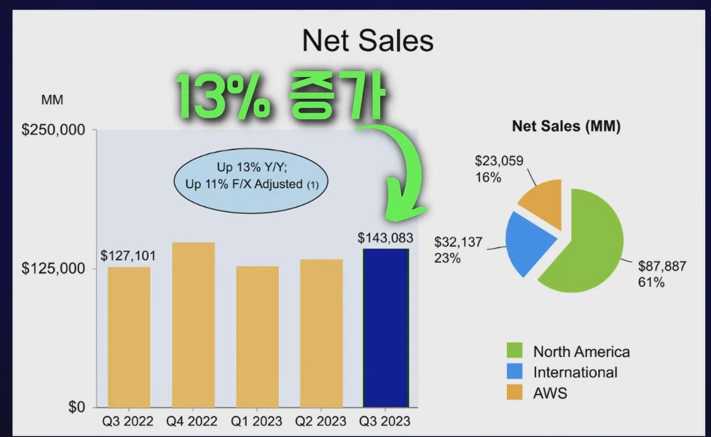

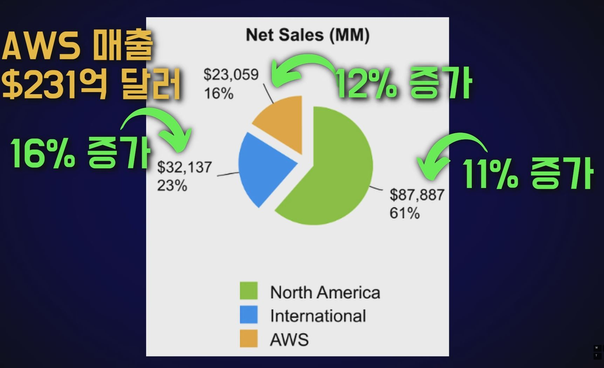

2. 매출구분

    - 온라인 매장 매출 $573억 달러
        
        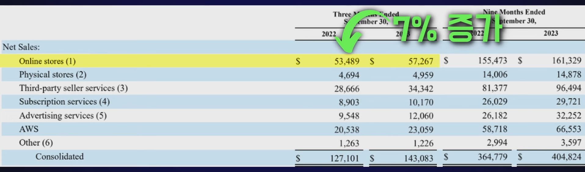

    - 오프라인 매장 매출 $50억 달러

        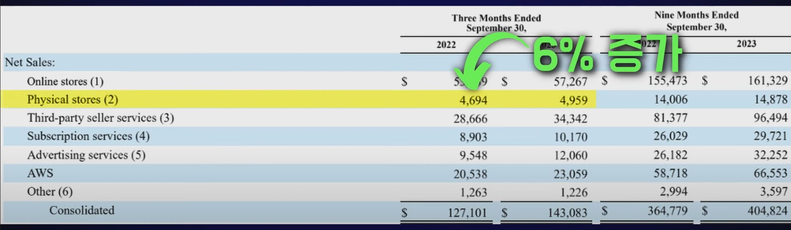

    - 제3자 서비스 매출 $343억 달러

        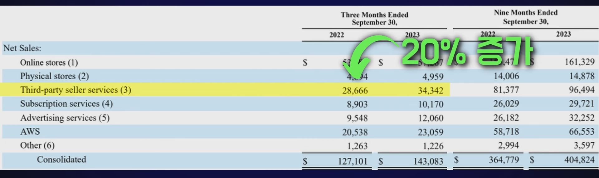

    - 구독서비스 매출 $102억 달러

        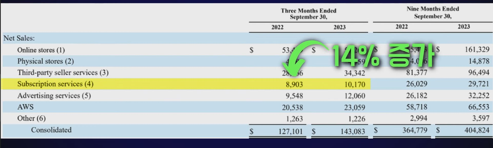

    - 광고 서비스 매출 $121억 달러

        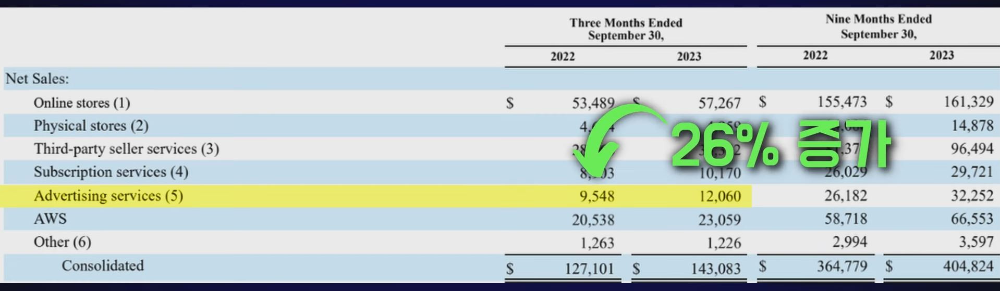

    - 기타 매출 $12억 달러

        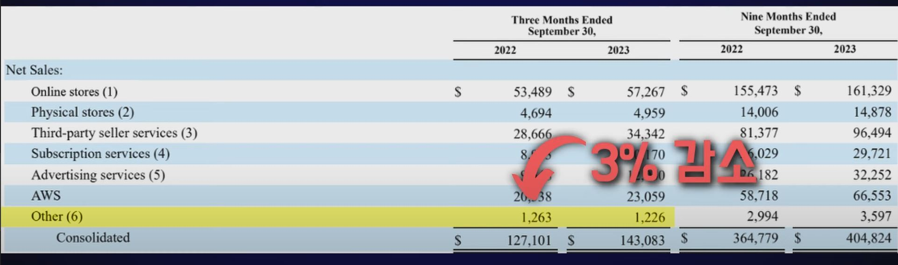
    
3. 연구개발비용

    - 기술 및 인프라 비용 : $212억 달러 (9% 증가)

    - R&D의 총 매출 대비 비중 : 14.8% (작년 15.3%)

4. 총 영업이익 : $112억 달러

    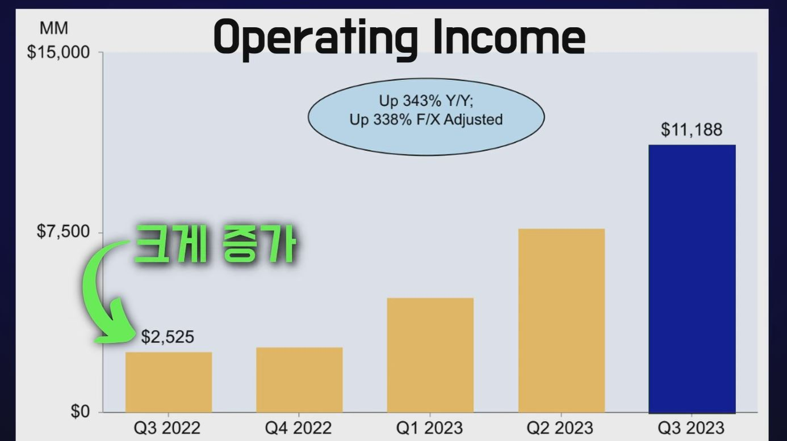

    - 북미 EBIT : $43억 달러
    
       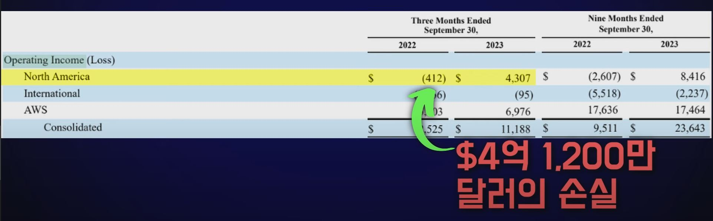

    - 국제 영업 손실 : $9,500만 달러
    
       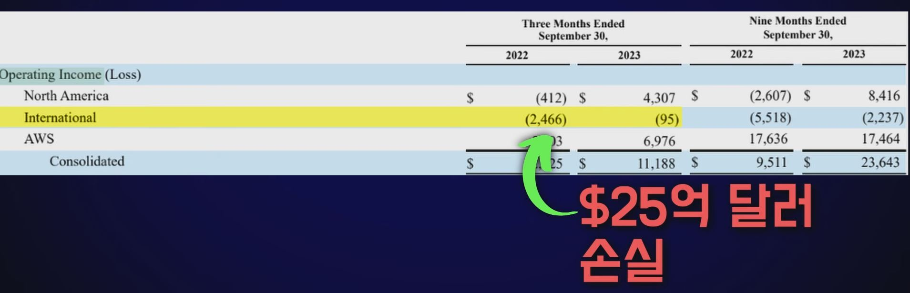

    - AWS의 영업이익 : $70억 달러

       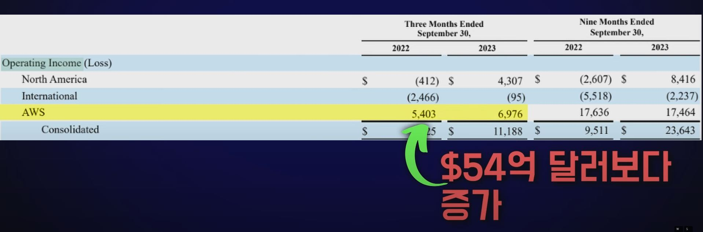

5. 자본지출

    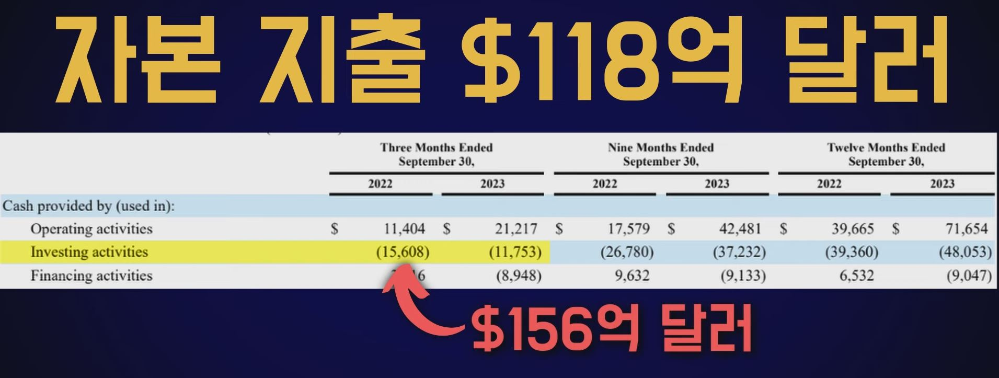

6. 영업 순현금흐름

    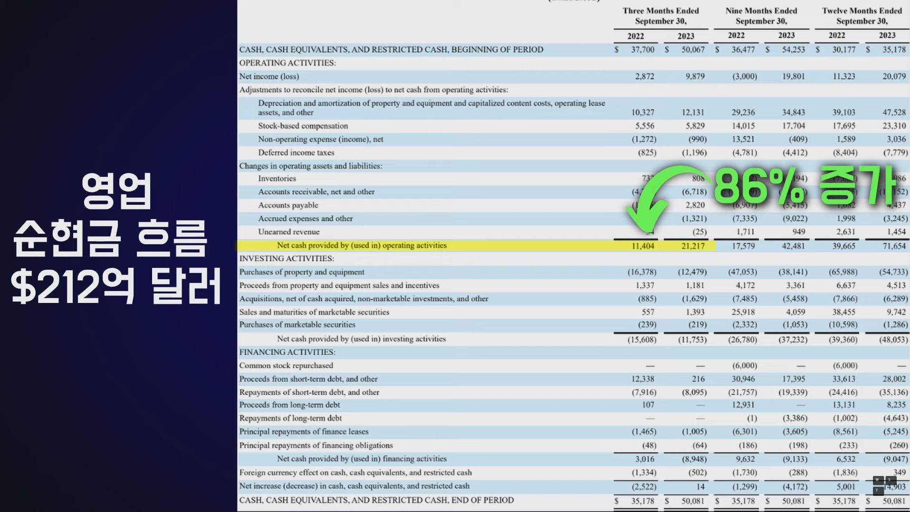

7. 자유현금흐름 : $214억 달러

    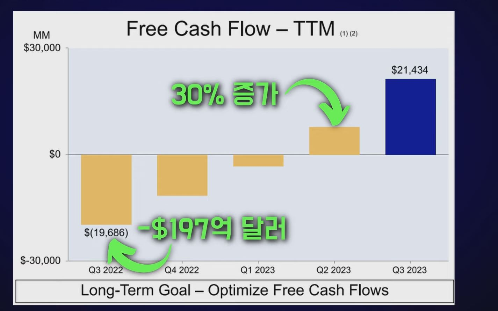

## 3. 투자자 Q&A

1. 클라우드 & 인공지능

    - AWS 마진이 6% 증가한 원인

        - 2분기 인원 감축
        
        - 인프라 비용 같은 기타 비용 절약 효과

        - 천연 가스 가격 하락

    
2. 리테일

    - Sequoia

        - 부상률 15% 감소

        - 75% 더 빠르게 식별

        - 주문 처리 시간을 최대 25% 단축

3. 광고 사업

    - 전자상거래

    - 머신러닝 알고리즘

    - 새로운 이니셔티브

## 4. 뉴스런

1. FTC 반독점 소송 영향

2. 10월에 이루어진 Prime Day가 작년 대비 더 Outpace함

    - 제3자 판매량 주문량 1억 5천만 개 이상
    
    - 주문당 평균 지출액 $53.47달러

    - 60%의 품목이 $20달러 미만에 판매

    - 4%만이 $100달러 이상의 가격

    - 올해 연말 소비자 지출 4.8% 증가한 $2,218억 달러