## 1. CEO 메시지

1. 지속적인 성장과 수익성 개선
    - 고객 경험 극대화
    - 운영 효율 증가

2. 플라이 휠

    

    - 지속적으로 1P 및 3P 상품군을 계속 확장
    - 활성 고객수는 전년 대비 14% 증가
    - 이커머스 매출 증가
    - 신선식품의 경우 시장 전반 성장률보다 두 배 이상 성장

3. 와우 멤버쉽과 쿠팡 이츠 

    - 고객 및 주문의 빠른 증가

    - WOW 회원의 적립 프로그램 참여가 90% 증가

    - 경영진은 이츠가 올해 말까지 약 20%의 시장 점유율을 차지할 것으로 예상함

    - 와우 회원 중 단 20%만이 이츠를 통해 소비를 했기 때문에 추가 성장 여력이 크다는 점을 강조

4. 대만 진출

    - 한국 출시 때와 비교하여 영업 첫해에 더 빠른 성장률을 기록

    - 12,000개가 넘는 중소기업이 단 1년 만에 대만으로 제품 수출 가능

## 2. 재무 성적표 요약

1. 영업 지표

    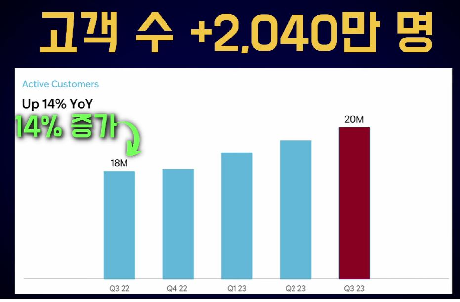

    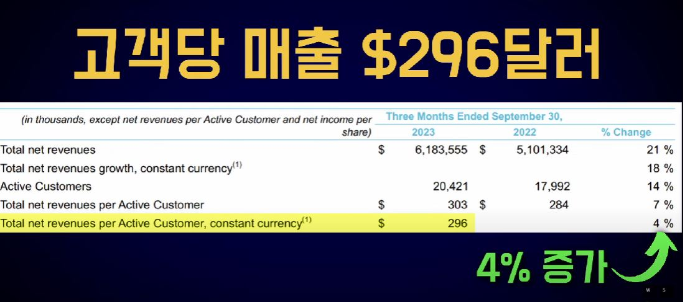

2. 매출

    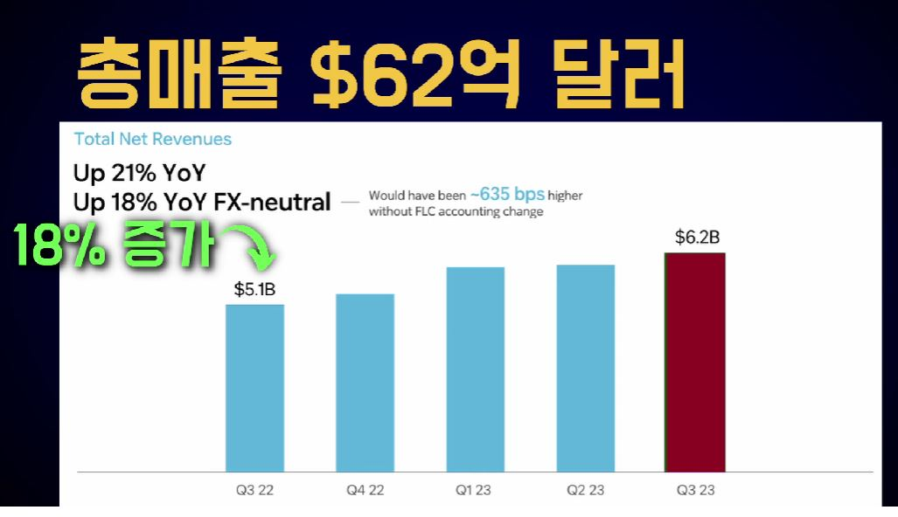

3. 매출 구분

    - Product Commerce $60억 달러

        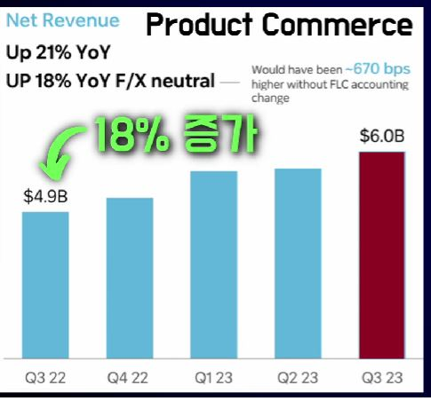

    - Developing Offerings $2억 1,800만 달러

    
        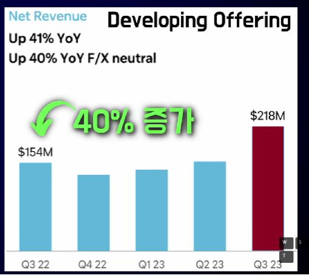

4. 영업비용 - $46억 달러

    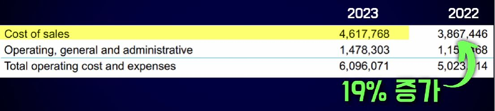

    - 일반관리비 - $15억 달러

        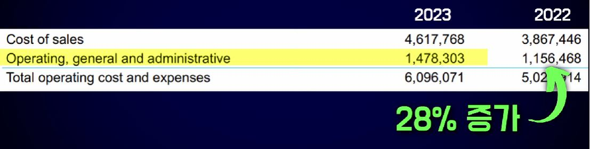

        - 회계정책 변경으로 인해 많이 증가

5. 영업이익 - $8,700만 달러

    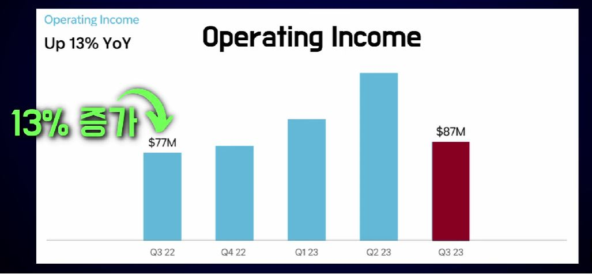

6. 현금흐름 : +$20억 달러

    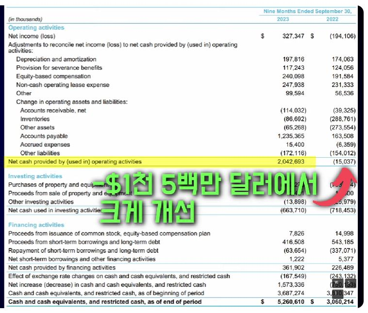

    - 유형자산 투자 : $6억 6천만 달러

        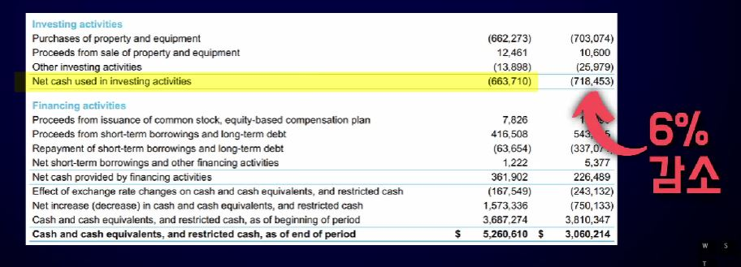

7. 현금흐름 12개월 롤링

    - 현금흐름은 $19억 달러

        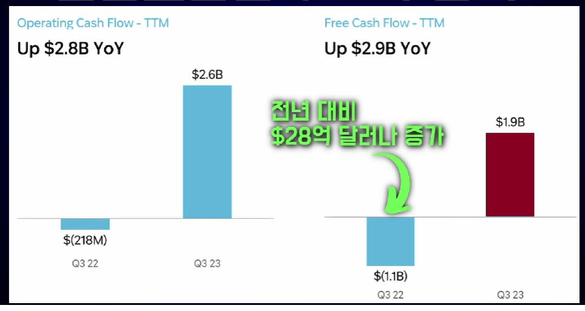

    - 현금잔고 $53억 달러

        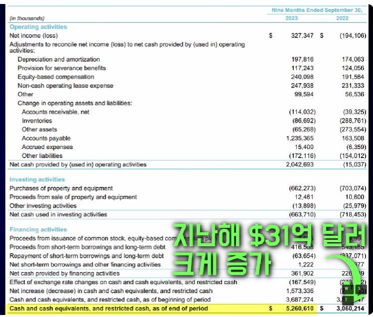

## 3. 투자자 Q& - DCF 모델에 영향을 주는 3가지 주요 내용

1. Product Commerce 사업부의 EBITDA 마진

    - 주요 원인은 상품군의 확대를 위해 신규 가맹점 입점 비용과 같은 일회성 비용이라고 밝힘

    - 이커머스에서 조정된 EBITDA 기준 10% 이상의 마진을 유지

2. Developing Offering 사업의 EBITDA

    - 신사업 투자가 4분기에는 감소할 것으로 예상

3. 한국에 진출하는 신규 이커머스 경쟁

    - 투자 성적이 나쁘지 않다고 볼 수 있음

## 4. 뉴스런

1. CJ의 시장점유율은 2020년 50.1%에서 이듬해 44.3%로 하락

2. 쿠팡로지스틱스서비스(CLS)를 2021년에 설립

3. 2022년 기준 13억개 택배를 배송(국내 전체 배송의 36.1%)

4. 쿠팡플레이 - 국내에서 가장 빠른 연간 가입자 증가율

    - 신규 사용자 수는 232만 명
    
    - 총 가입자 수 600만 명을 돌파

    - 플레이의 가입자 수는 634만 명

    - 한국에서의 독일 분데스리가 독점권 확보