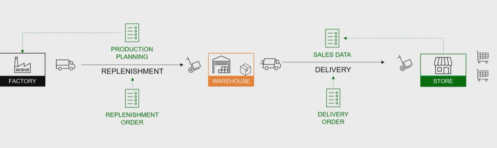
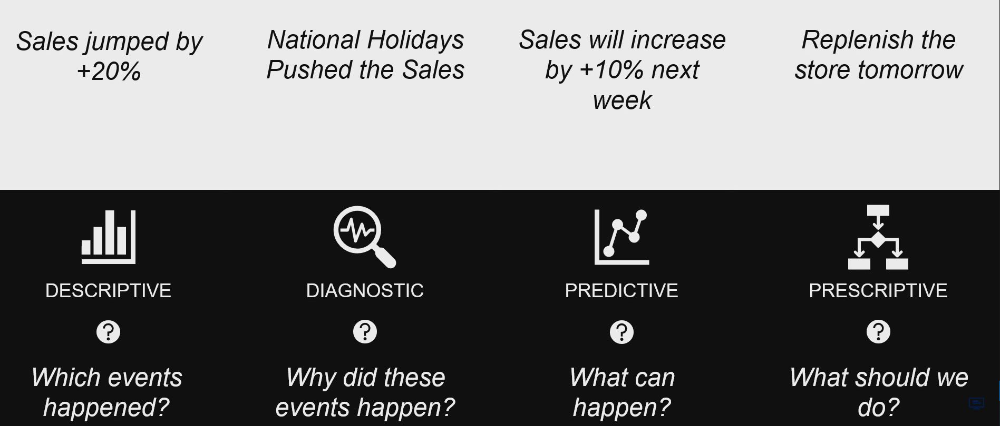
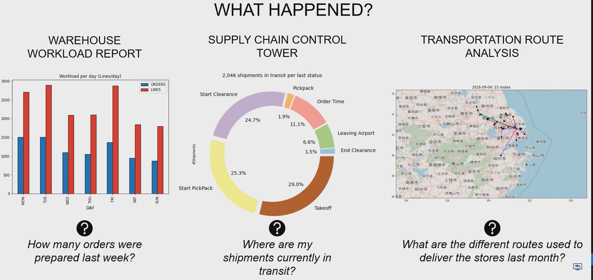
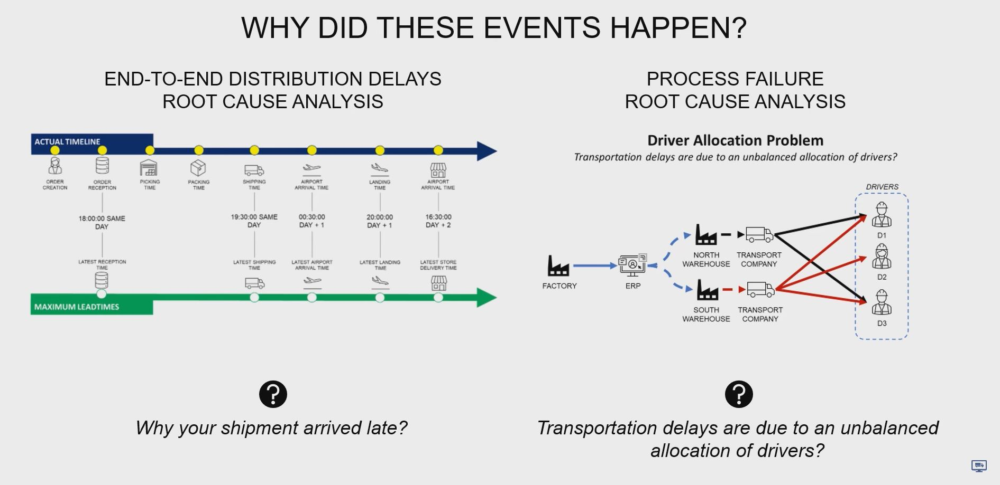
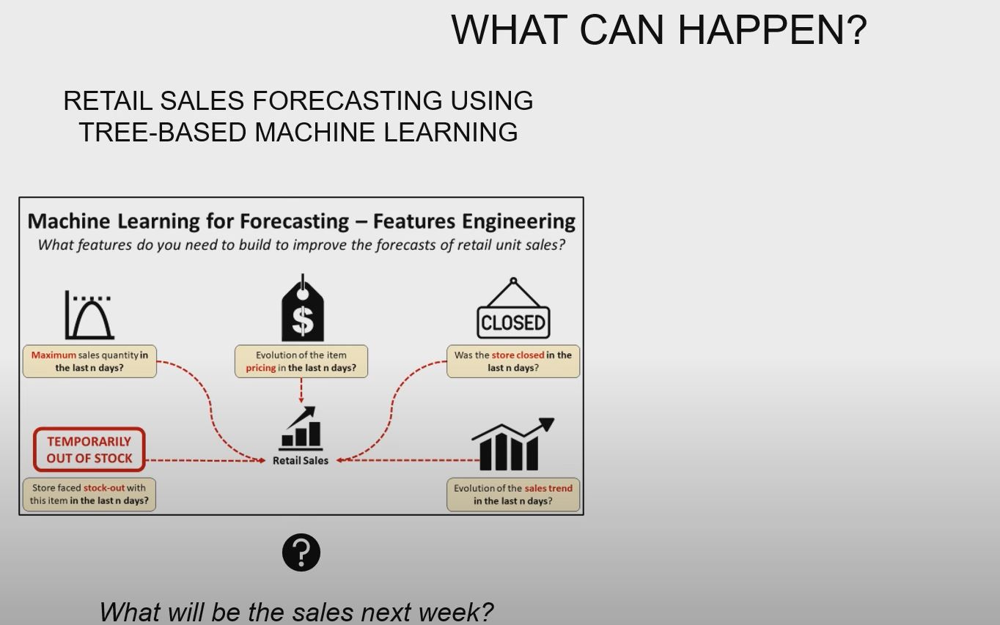
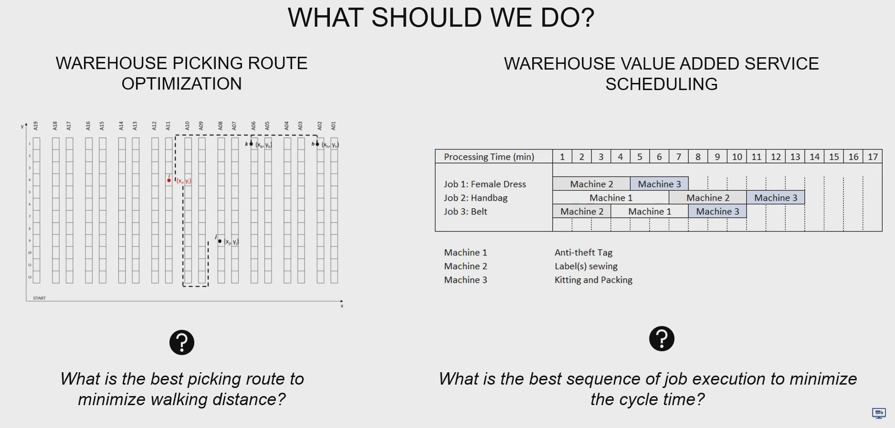

## 1. Definition of Supply Chain

- Flow of Goods & Information

## 2. Type of Supply Chain Analytics

## 3. Descriptive Analytics

## 4. Diagnostic Analytics

## 5. Predictive Analytics

## 6. Prescriptive Analytics

