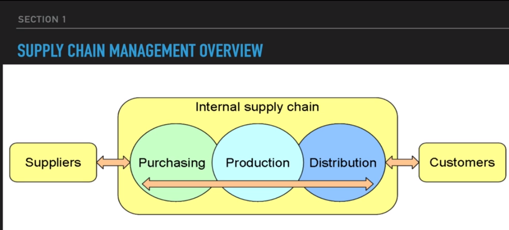
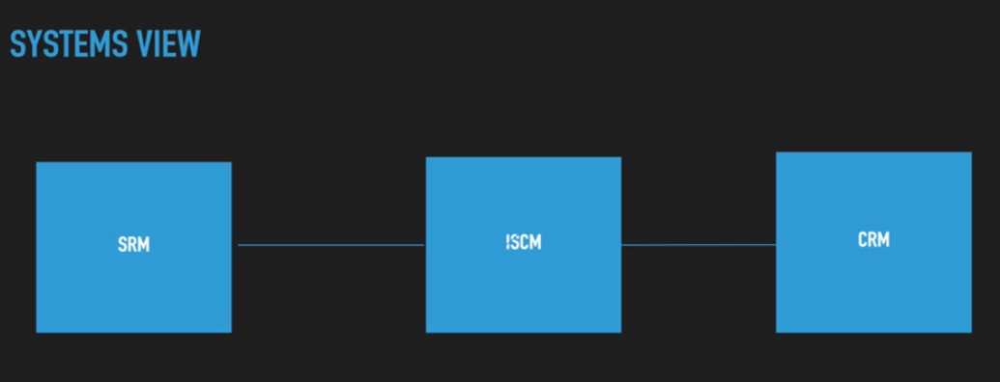

## 1. Supply Chain Management Overview

1. Overview
    

2. SYSTEMS VIEW 
    

3. Material Flow

    - Raw Material

    - Components

    - Work In Progress

    - Finished Goods.

4. Information Flow

    - Thats were data science comes in.

    - Websites, traffic, conversions...

    - Invoices

    - Purchase Orders

    - Packing Lists

    - ERP Systems.

    - Customer Data

    - Baskets