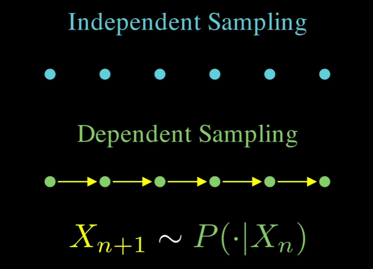
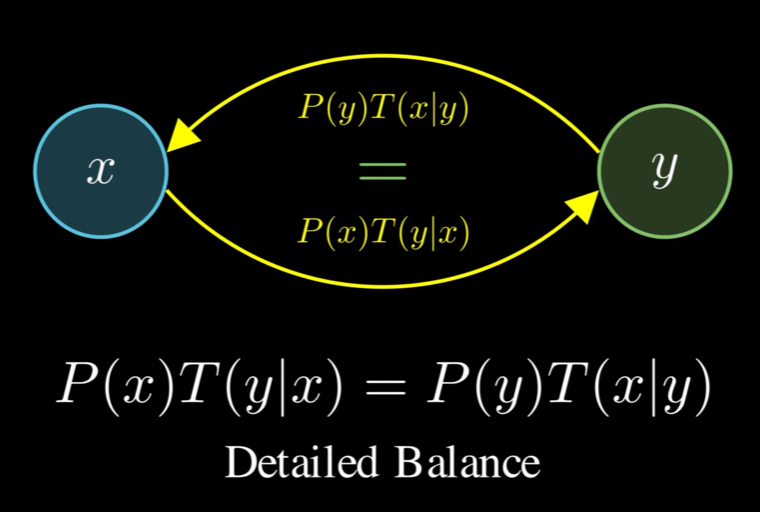

## 1. Key Insight

## 2. Monte Carlo Method (MCMC)

- In high dimensions, getting good samples becomes nearly impossible with pure randomness. That's where marrying Monte Carlo with Markov Chain becomes brilliant. 

## 3. Mathematical Foundation

