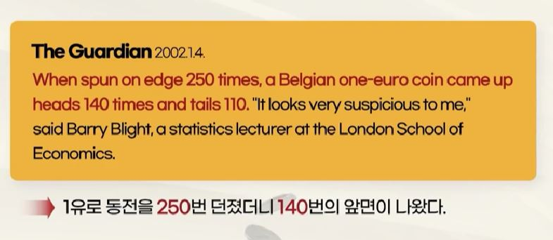

## 1. 불확실성이란 무엇인가?

- 동전을 던지는 순간 결과 자체는 불확실하지 않음
    - 정확한 계산으로 결과를 예측하기 힘들기 때문에 불확실하다고 느끼는 것

- 주사위를 던지는 순간 결과는 이미 결정되어 있음
    - 복잡한 계산으로 결과를 예측하는 것이 불가능하기 때문에 불확실하다고 믿는 것

## 2. 두려움을 없애기 위해 인류가 택한 방법은?

- 점성술
    - 불확실성을 예측하믕로써 두려움과 불편함 제거

- 확률
    - 불확실성을 확률로 나타내면서 편안함을 느낌
        
        - 내일 A 회사 주식 가격이 오를 것 같다 vs 내일 A 회사 주식 가격이 오를 확률이 70%이다.

## 3. 확률이 도입되어야 하는 이유는?

- Q1. 어느 동전을 1,000번 던졌더니 앞면이 530번, 뒷면이 470번 나왔다. 이 동전은 앞면이 더 자주 나오는 동전인가?
    - By 수학, 공정한 동전이라면 앞면이 530번 이상 나올 확률은 약 3.1% => 앞면이 더 자주 나오는 동전으로 판단

- Q1. A와 B가 후보로 나온 대통령 선거에서 1,000명에게 여론조사를 해보니 A와 B를 지지하는 사람이 각각 530명, 470명이었다. 현재 A후보가 유리한 상황인가?
    - By 수학, 두 후보가 동등한 상황이라면 이 같은 결과가 나올 확률은 약 3.1% => A 후보가 유리한 상황으로 판단

## 4. 불확실성을 이해하고 있다?

