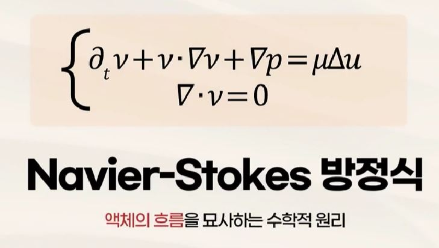
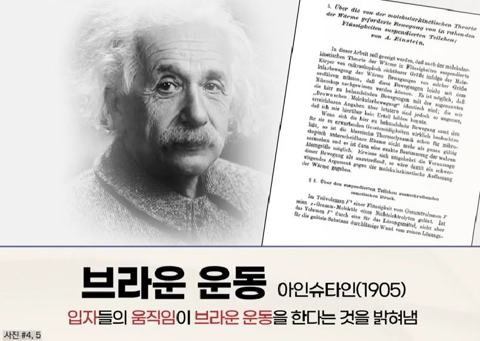

## 1. 불확실성을 바라보는 관점

- 도박
    - 규칙이 있어 이해가 가능한 불확실성

- 바이러스의 확산
    - 명확한 규칙이 없는 복잡한 불확실성

## 2. 복잡한 불확실성의 이해

## 3. 복잡한 불확실성 속에 존재하는 규칙

- 주사위를 1번 던졌을 때 3이 나올 확률: 1/6
- 주사위를 2번 던졌을 때 합이 6이 나올 확률: 5/36
- 주사위를 10,000번 던졌을 때 합이 25,000이 나올 확률: ?????
