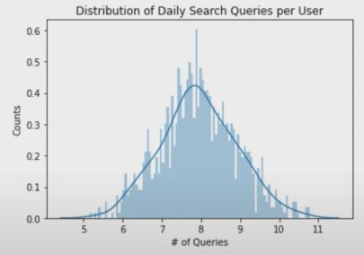
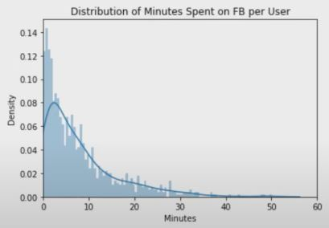
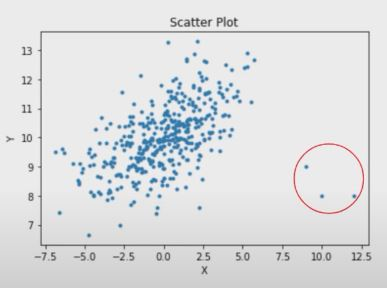
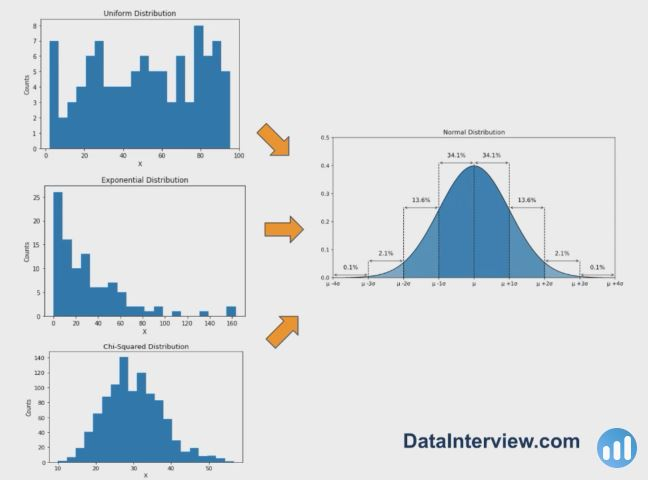

## 1. Central Tendency

1. Where to Use
    - In data science interviews, you might stumble upon a business case problem where you have to describe the shape of a distribution.

    - In order to describe the shape of the distribution, Use something called Central Tendency.

2. Definition
    - Describes where most of the data lies in a distribution.

3. Formula
    - Mean : Sum of values divided by the # of values
    - Median : Middle value in an ordered list
    - Mode : Most frequent value 

4. Pros & Cons
    - Mean 
        - Pros : Utilizes all the values
        - Cons : Sensitive to outliers
    
    - Median
        - Pros : Robust against outliers
        - Cons : Use only one value 
    
    - Mode 
        - Pros : Useful for categorical variables
        - Cons : Uses only one value

5. Problem 1 : A PM at Google asked you to describe the distribution of daily search queries per user. How would you desribe it?

    

    - The distribution of daily search queries is normal with the mean at around 8, and the median and mode are also at around 8.

6. Problem 2 : A PM at Meta asked you to describe the distribution of daily minutes spent on FB per user. How would you describe it?

    

    - The distribution of daily minutes spent on FB per user is exponential with the mean somewhere between 6 and 9, and the median and mode at around 2.

## 2. Dispersion

1. Definition
    - Describes the spread of data in a distribution

## 3. Correlation

1. Definition
    - Describes the strength of a linearity between two variables.

2. Problem : A data scientist manager at Google asked you : How would you measure correlation in the presense of outliers? How would you address this question?

    

    - Analysis 
        - Outliers can deflate or inflate the correlation

    - Solution 
        - IQR Method
        - Scaling

## 4. Normal Distribution

1. Definition
    - A probability distribution that is symmetrical around center and the extremes tapered off.

2. The 66-95.99.7 Rule

3. Central Limit Theorem (CLT)
    - Distribution of sample means approximates a normal distribution as the sample gets larger, regardless of the population distribution.

    

## 5. Hypothesis Testing

1. Business Problem
    - Suppose that a PM claims that users, on average, spend about $50 per month on Amazon.

    - However you doubt this claim, and you believe that the average should be higher.

    - So, you sample 100 users and learn that the sample mean is $85.

    - Would you reject the PM's claim?

2. Definition
    - A hypothesis testing is a way to test an assumption about a population parameter.

3. P-value & Significance Level
    - P-value
        - The probability of observing a sample value or more extreme given that the null hypothesis is assumed to be true

    - Significance Level
        - The probability of rejecting the null hypothesis assumed to be true.

4. Solution
    - Assume that the population standard deviation is 20.

    - State the Hypothesis Statement
        - H_0 : The average spend per user is $50
        - H_a : the average spend per user is greater than $50

    - Set the Significance Level
        - Alpha = 0.05
    
    - Calculate the Test Statistic
        - Z-statistic = 85 - 50 / 2 = 17.5
    
    - Calculate the P-value
        - P-value < 0.0001 < Alpha = 0.05

    - Make a Statistical Dcision
        - At alpha = 0.05, there is statistical significance to reject PM's claim and conclude that the average spend per user is greater than $50

## 6. Other Statistical Concepts

1. Distributions
2. Bayes Theorem
3. ANOVA
4. Sampling
5. Non-Parametric Tests
6. Permutation Tests
7. Confidence and Credible Intervals
8. Regression Modeling
9. Non-Normal Distributions
10. Maximum Likelihood
