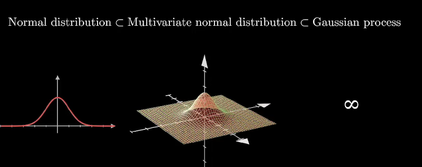

## 1. Idea

The Idea is based on a given input to consider all functions and add a probability to each of them.

So we can determine which of them we believe are more likely than others.

## 2. Gaussian Process

Being precise, Gaussian process are not really a probability measure over functions.

But Let's just say it is a valid way of thinking of them.

In this video, I just want to give you an idea of how to categorize them rather than going into details. 

We are starting with the normal distribution.

Let me remind you that this probability distribution is fully characterized by its mean and variance which among others makes it so thankful to work with.

Drawing a random sample from the normal distribution will give us a number distributed around its mean.

We can generalize the normal distribution to sample not a number but a vector of numbers which is called multivariate normal distribution.

We can even more generalize to sample an infinite vector of numbers and this will lead to gaussian process.

