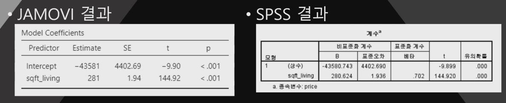

## 1. 회귀분석이란

1. 목적 : 주어진 데이터의 독립변수로 종속변수를 예측
2. 결론적으로 직선형태의 추세선을 구함
3. 추세선의 식은 $y = ax + b$
    - a는 constant
    - b는 slope
4. 이 추세선을 구하기 위해 사용되는 방법은 최소제곱법
    - 오차의 제곱의 합을 최소로 만드는 방법
5. 최소제곱법으로 구해진 직선이 우리가 원하는 회귀분석식
    - 이 직선은 평균을 지난다 (평균으로의 회귀)
    - 이 방법을 영어로 Ordinary Least Square (OLS)라고 함

## 2. 회귀분석의 결과표

1. 
2. 해석을 어떻게 해야할까?
    - Intercept(절편/상수)는 우리의 관심사가 아님 - 왜 일까?
    - 우리의 관심은 Estimate(회귀계수) 방향과 p-value

## 3. 