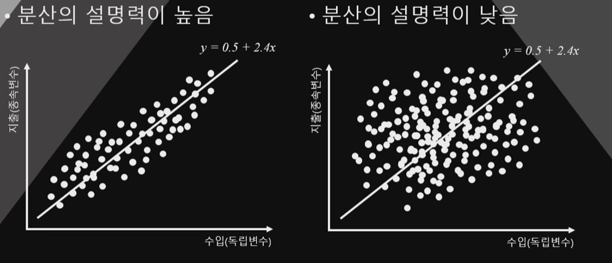

## 1. $R^2$란 무엇일까?

1. 통계란 무엇이다? -> 분산의 마법
2. 보통 회귀분석에서는
    - 종속변수와 독립변수의 인과관계를 논리적/이론적으로 전제하고 독립변수와 종속변수를 설명
    - X가 1 증가할 때, Y가 $\beta$(회귀계수)만큼 증가

3. 그런데 회귀분석 뿐 아니라 통계는 결국
    - "분산을 얼마나 잘 설명하는가"가 목적
    - 회귀분석이란 종속변수의 분산을 독립변수로 설명하는 과정

4. 통계적 분석의 정의
    - 이론/논리를 통해 종속변수를 설명할 수 있는 모델 생성
    - 이 모델에 들어가는 독립변수 설정
    - 종속변수의 분산을 모델(독립변수)로 설명
    - 모델(독립변수)이 큰 문제가 없다면 모델로 설명하고 남은 오차는 random한 오차

    

5. 어떤것이 더 종속변수의 분산을 잘 설명할까?

    
    
6. $R^2$ 계산법

    - $R^2$ = 1 - SSE / SST
    - SST =  $\sum (y_i - \bar{y_i})^2$
    - SSE =  $\sum (y_i - \hat{y_i})^2$

7. $R^2$는 0부터 1까지만 존재

    - $R^2$ = 0 : 모델 설명력이 0
    - $R^2$ = 1 : 모델 설명력이 100%

## 2. $R^2$의 의미와 해석

1. $R^2$가 높으면 무조건 좋은것인가?
    - 절대 그렇지 않음
    - 나름의 의미는 있으나, 높은 $R^2$가 모든 것을 완벽하게 하지는 못함
        - $R^2$를 확인하기 전에 잔차도(Residual Plot)이 완벽하게 랜덤하게 분포함을 확인해야 함
        - <b>의미없는 독립변수의 추가 조차도 $R^2$를 약간이라도 증가</b>시킴
        - 그렇지만 독립변수의 추가는 자유도를 1 증가시켜 비용이 발생
        - 높은 $R^2$는 과적합 문제로부터 자유롭지 않음.
    

## 3. $R^2$대신 사용할 수 있는 것은?

1. 보정이 필요
    - 추가된 독립변수가 자유도 1을 잃고도 충분히 분산을 설명했는지 여부
    - 자유도가 감안된 $R^2$가 필요
    - 이것이 adj.$R^2$(수정된 $R^2$)임
    - 보통 $R^2$와 adj.$R^2$를 같이 리포트함
    - 둘의 크기가 심하게 다르다면 의미없는 독립변수를 너무 많이 넣었다는 의미

## 4. 과적합 문제 해결 방법

1. 분석대상은 표본
    - 모델이 이번에 수집한 표본에서만 높은 $R^2$를 보인다면?
    - 다른 표본에서는?

2. 판단 및 해결책
    - Cross Validation을 적용
        - 표본을 랜덤하게 둘로 나누어 한 표본에서 모델을 구축하고 난 뒤
        - 다른 표본에서 모델의 적합성을 다시 테스트