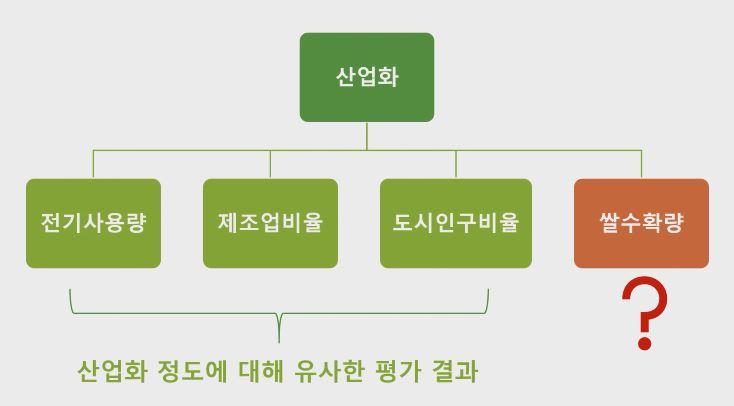

### 1. 신뢰도
1. 측정척도의 신뢰도(Reliability)란 측정척도가 측정하려고 의도하는 것을 얼마나 정확하게 오차없이 측정하고 있는지를 나타냄

2. 동일한 개념(또는 대상)을 유사한 척도로 측정할 경우 일관된 결과를 산출하는 정도
    - 신뢰도가 높다는 것은 동일한 개념을 측정하기 위해 고안된 서로 다른 측정도구가 같은 결과를 산출한다는 의미
    - 또는 동일한 측정도구를 이용하여 시간 간격을 두고 측정하였을 때 두 결과의 일치도가 높다는 의미

3. 예시

    

### 2. 크론바흐 알파계수(Cronbach's Coefficient $\alpha$)

1. 하나의 개념을 여러 측정항목으로 측정할 때 나타나는 항목 간의 일관성이나 동질성의 정도를 나타내며 이를 내적일관성(Internal Consistency)이라고 함.

2. 0에서 1 사이의 값을 가지며 클수록 측정항목의 신뢰도가 높음

3. $\alpha >= 0.8$이면 바람직, $\ 0.8 > alpha >= 0.6$이면 수용할만, 그렇지 않으면 신뢰도 결여