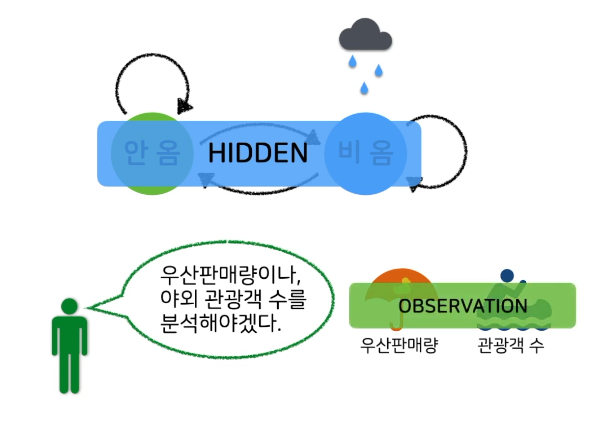

## 1. Markov Assumption (Markov Property)

- 미래의 상태는 오직 현재의 상태의 영향만 받는다는 가정 

## 2. 마르코프 모델 - 확률 계산의 간단함

- Before : P(나는 오늘 친구와 함께 학교에 간다)

    - P(나는) * 
    - P(오늘 | 나는) *
    - P(친구와 | 나는, 오늘) *
    - P(함께 | 나는, 오늘, 친구와) *
    - P(학교에 | 나는, 오늘, 친구와, 함께) *
    - P(간다 | 나는, 오늘, 친구와, 함께, 학교에)

- After : P(나는 오늘 친구와 함께 학교에 간다)

    - P(나는) * 
    - P(오늘 | 나는) * 
    - P(친구와 | 오늘) *
    - P(함께 | 친구와) *
    - P(학교에 | 함께) *
    - P(간다 | 학교에)

## 3. Hidden Markov Model (HMM)

- 마르코프 체인을 이용하여 훈련할 때, 연쇄가 직접 드러나지 않아서 오디오 파형과 같이 보이는 대체물을 이용하여 간접적으로 훈련하는 모델

## 4. 날씨 예시

- 비를 직접적으로 볼 수 없는 상황에서 날씨를 예측하는 모델

    - 우산판매량이나 야외 관광객 수를 분석하여 내일 비 올 확률에 대한 모델을 학습할 수 있음 

    