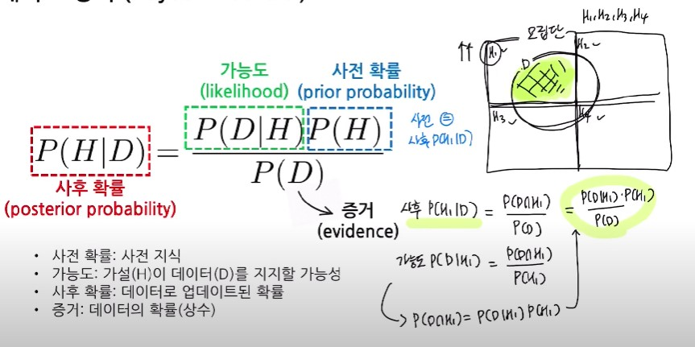
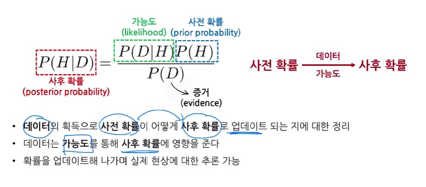
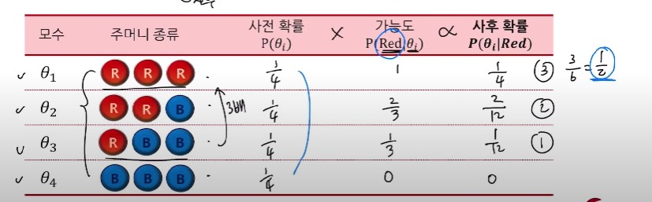
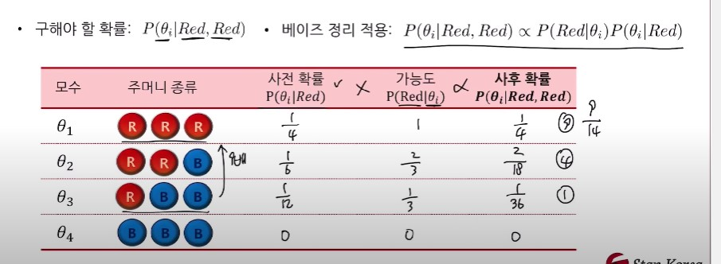
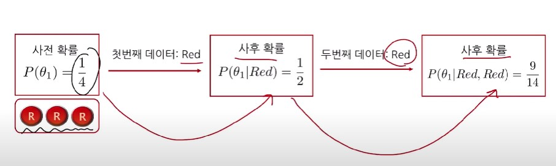
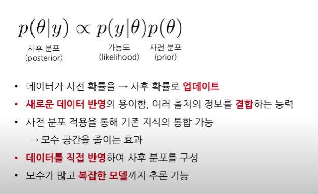
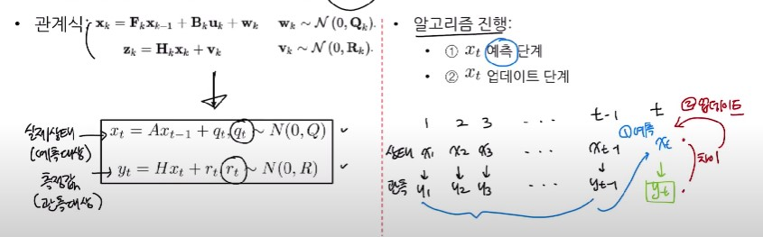
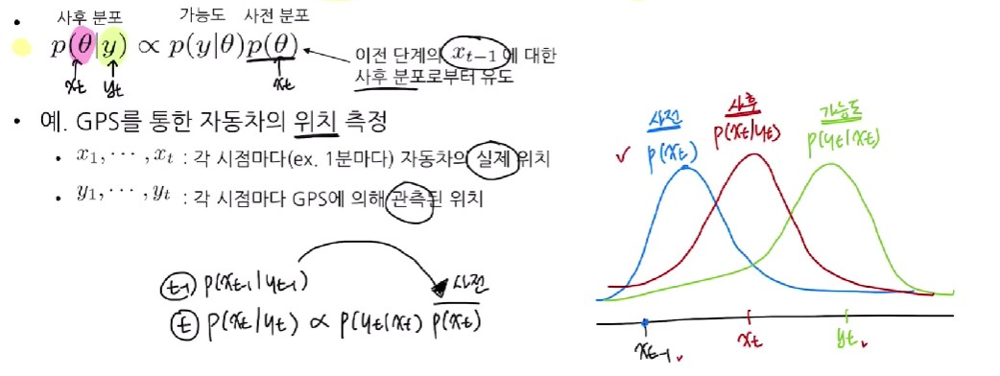

## 1. 확률의 정의 1 - 빈도주의 관점

- 확률 = 상대적 빈도(relative frequency)의 극한 = (관심 있는 사건 발생 횟수 / 전체 시행 횟수)의 극한
- 동일한 시행을 무한히 반복했을 때의 빈도(long-run frequency)
- 랜덤 사건(random event)의 확률 설명 가능
    - ex - 동전 던지기, 주사위 던지기, 카드 뽑기
    - 주사위를 던져 3이 나올 확률

- 한계
    - 무한 반복 X, 빈도 계산 X -> 확률 계산 불가능
    - 인식론적 불확실성(epistemic uncertainty) 설명 -> 새로운 확률 정의 필요!!

## 2. 확률의 정의 2 - 베이지안 관점

- 확률 = 믿음의 정도 (degree of belief)
    - ex - '내일 비가 올 확률은 30%밖에 안 돼"
    - ex - 90%의 가능성으로 A를 받을거라 믿어
    - 다양한 상황에 확률을 부여하는 믿음의 수량화(quantify)
    - 불확실성 측정의 도구(measure of uncertainty)

## 3. 베이즈 정리

## 4. 베이즈 추론 예시

- Q. 빨간색과 파란색 공으로 이뤄진 4종류의 서로 다른 주머니에서 임의로 하나의 주머니를 택한 뒤, 공을 한 개 뽑았더니 빨간색 공이었다. 나는 어떤 주머니를 택했던 걸까?

- 구해야 할 확률 : $P(\theta_i| Red)$ 
- 베이즈 정리 적용 : $P(\theta_i| Red) = \frac{P(Red|\theta_i)P(\theta_i)}{P(Red)}$ -> $P(Red|\theta_i)P(\theta_i)$

    

- Q. 꺼냈던 공을 주머니에 넣은 뒤 동일한 주머니에서 공을 다시 뽑았더니 또 빨간색 공이었다. 이때 각각의 주머니에서 택했을 확률은?

    

    

## 5. 베이즈 추론 (Bayesian Inference)

## 6. 베이즈 추론 적용: 칼만 필터(Kalman Filter)

- 칼만 필터 : 측정값이 오차항을 포함하는 경우 실제 상태를 추정하는 알고리즘
    - ex - 자동차, 비행기의 위치, 속도 측정
    - ex - 측정위치 : 38도 N != 실제위치 37도 N

- 베이즈 정리를 각 시점마다 반복적으로 적용하여 현재 상태 $x_t$를 추론

