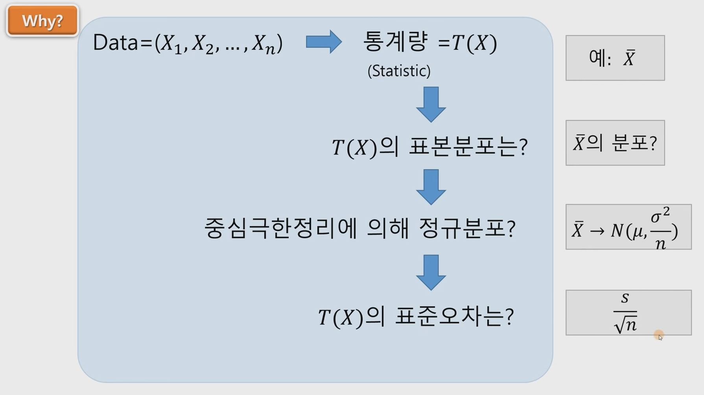
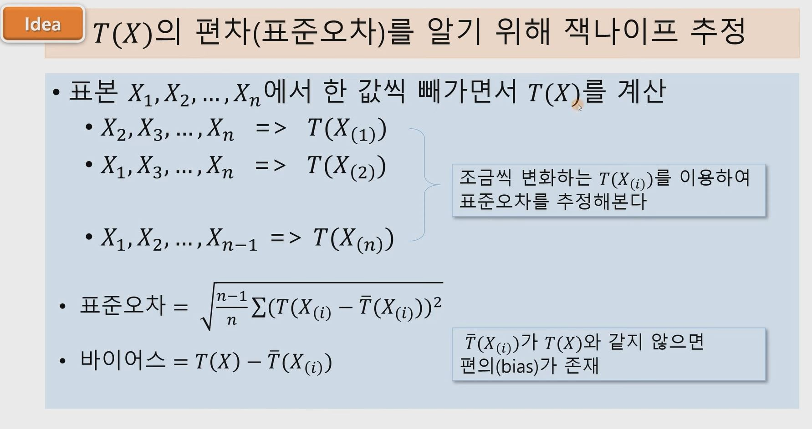
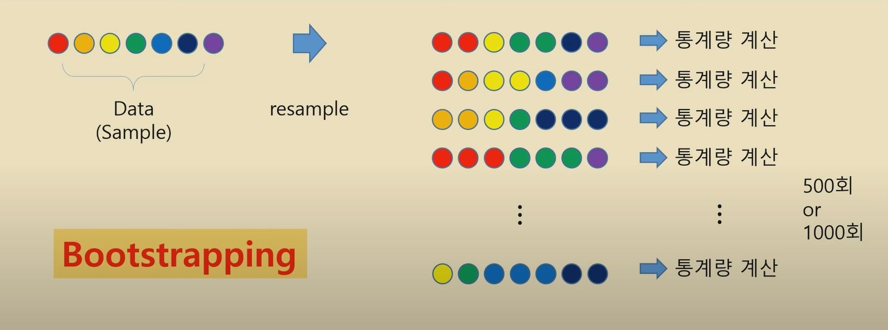
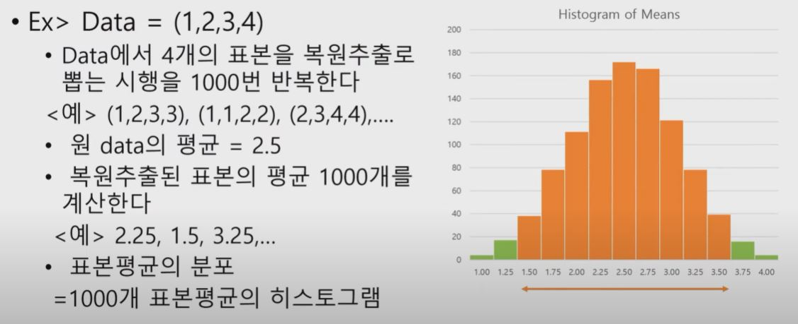
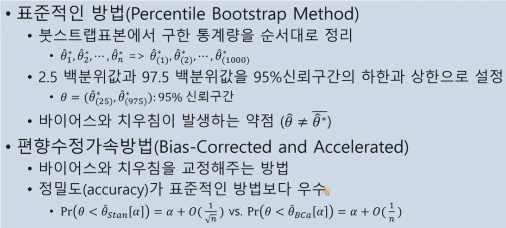

## 1. 부트스트랩 방법이란?

- 표본에서 표본을 다시 뽑는 resampling 방법을 이용
- 재표본을 통해 통계량의 분포를 추정
- 모집단의 분포의 정규성 가정이 필요없는 비모수적 추정방법

## 2. Jackknife Resampling

- 표본에서 하나씩 제외하고 표본을 뽑는 방법

    

    

- 우리가 얻은 표본 $X_1, X_2, ..., X_n$에서 
- 일부만을 다시 Resampling 하여 (하나씩 빼가면서 n번)
- 필요한 통계량 T(X)의 표준오차와 바이어스를 추정하는 방법임
- 그러나 T(X)의 분포에 대한 정보는 없음

## 3. 부트스트래핑 방법의 제안

- Efron(1979)이 Jackknife 방법을 확장한 Bootstrap 방법 제안 (복원 추출로 같은 수의 표본을 뽑는 방식)

    

## 4. 부트스트래핑의 개요

- 원래 Sample을 Population(모집단)으로 간주

- 원래 Sample에서 반복적으로 Resample하여 Sample을 얻음
    - 이때 표본추출방법은 복원추출(Sampling With Replacement)이다

- 각 표본에서 통계량값을 계산하고 이를 이용하여 통계량의 표준오차와 바이어스(편향)를 계산할 수 있음

- 계산한 통계량값을 (500~1000개) 순서대로 나열하여 모수의 신뢰구간 추정이 가능

## 5. 간단한 예제

## 6. 부트스트랩 방법의 개선

## 7. 부트스트랩 방법의 미래

- 1980년대에 개발된 방법이 이제야 활발히 사용됨
    - 컴퓨팅 능력의 발전에 의해 사용이 용이

- 데이터에 대한 특별한 가정이 필요없는 비모수방법
    - 복잡한 이론전개 필요없이 사용가능
    - 사용범위가 무한정 확대될 수 있음
    - The crazy uncle in the attic(중앙값, 절사평균 등)을 세상으로

- 모든 통계분석이 부트스트래핑 방법으로 통일?

