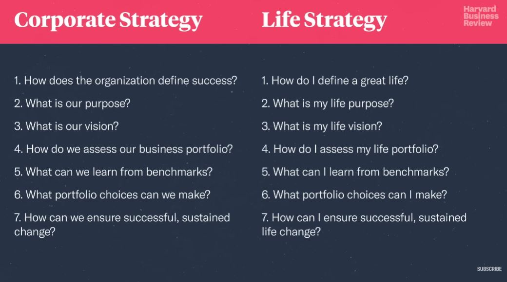

## 1. Corporate Strategy & Life Strategy

## 2. Life Strategy

1. How do I define a great life?
    - P : Positive emotions
    - E : Engagement
    - R : Relationships
    - M : Meaning
    - A : Achievement
    - V : Vitality

2. What is my life purpose?

3. What is my life vision?

4. How do I assess my life portfolio?

5. What can I learn from benchmarks?

6. What portfolio choices can I make?

7. How can I ensure a successful, sustained life change?
