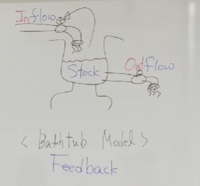

### 1. Bathtub Model

- Inflow때문에 Stock이 달라짐
- Stock때문에 Inflow가 달라짐 (Feedback)

- System Dynamics의 핵심은 <b>Feedback</b>

### 2. 피드백이 있는 성장(Growth)의 비밀

1. 마법의 저금통, 1원, 1년, 100% 이자

    - 1년에 2번 50%씩 이자를 받는다면?
        - $(1+ 1/2) ^2$

    - 1년에 n번 
        - $(1 + 1/n) ^n$

        - n이 무한대로 가면 자연상수 e

2. Doubling Time

    - 성장률 * 횟수(Time) = 72
        - ex : 10% 수익률로 7.2년 정도면 원금은 대략 2배가 됨

        

