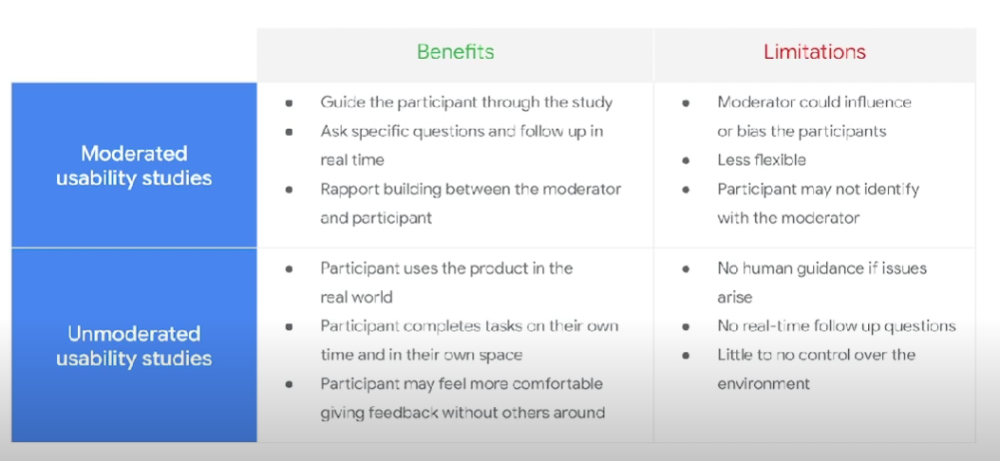

## 1. Two Type of Usability Test

1. Moderated
    - A moderator guides participants through the study in real time.
2. Unmoderated
    - Particiapants test out the prototypes without human guidance.

