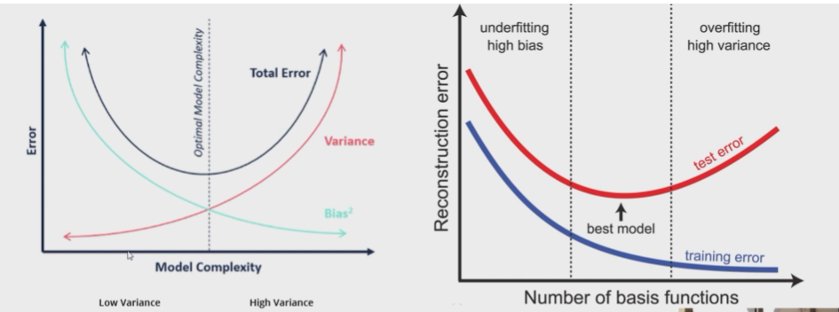

1. Bias-Variance TradeOff

Bias is the difference between your expected value and what we're actually estimating.

It's like a constant that you're off of your target.

Variance is spread around the point where you want to be.

So we can make 2 by 2 Matrix
- Low Bias - Low Variance
- Low Bias - High Variance
- High Bias - Low Variance
- High Bias - High Variance

In general, there is trade-off between bias and variances. So it's called the bias variance dilemma.

Think this tradeoff with Overfitting & Underfitting.

2. Difference between Train & Test & Validation Set

Train set is what you actually train on

Validation set is what you use to determine whether your model can actually learn any further or wheter it's already overfitting.

Test set is used to estimate the generalization error.

3. What model would you favor if you were given?  Assume you have the results for two models on a dataset. The neural network comes in at 94 percent and your decision tree comes in at 91 percent.

There is no right or wrong here. 

It definitely gives you an opportunity to talk about the trade-off between interpretability and well accuracy or whatever metric you're trying to optimize.

The decision tree is way easier to understand.

Neural networks may perform better.

But this does not mean that you have to favor one especially in processes where validating the result is important or explaining to the customer why he's not eligible for a loan 

4. Query Question

5. Behavioral Questions like what would you do if a stakeholder tells you these features are the best features for your ML Model but you discover other features are more valuable 

6. How do you approach a problem where you have no labels?

7. If you have an API, how would you load a csv?

Don't be too confident in questions where you do not really know the answer.

8. What is PEP8?

PEP8 is most common python programming guideline. 

9. What is Confusion Matrix?

10. Difference between Outliers and Anomalies

11. GridSearch

GridSearch is a method to figure out the hyper parameters for your model.

Hyper parameters are parameters that are not directly learned by your model but are effectively specified by you.

